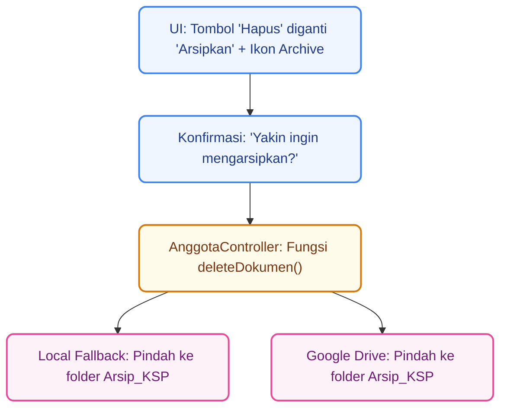

# Plan 1

## Rencana Implementasi: Restrukturisasi Arsip KSP_Trash Berbasis Tahun & Penambahan Menu Laporan Arsip

Berdasarkan revisi dokumen dari pihak KSP, struktur penyimpanan arsip (`KSP_Trash`) di Google Drive saat ini perlu dikategorikan lebih rapi lagi, yakni **dikelompokkan berdasarkan Tahun Bergabungnya Anggota**.
Selain itu, di antarmuka Laporan & Analitik (untuk *Manager*), perlu ditambahkan **kotak menu baru bernama "Arsip"** di samping menu "Pembukuan".

## 🛠️ Ringkasan Tujuan

1. **Pembaruan Struktur Folder Drive (`KSP_Trash`)**: Mengelompokkan folder anggota arsip ke dalam folder induk berbasis tahun (misal: `2026`, `2027`), agar jika berganti tahun, folder root KSP_Trash tidak dipenuhi oleh ratusan folder anggota secara mendatar.
2. **UI Penambahan Menu Arsip (Manager)**: Menambahkan modul card "Arsip" pada halaman Laporan (`/laporan`).

---

## 🗂️ Gambaran Struktur Folder Google Drive Terbaru

```text
Google Drive (Drive Saya)
│
├── 📁 KSP
│   ├── 📁 001_Ahmad Rizki
│   │   ├── 📁 profil
│   │   │   ├── ktp_ahmad.pdf          <-- (File Aktif Saat Ini)
│   │   │   └── kk_ahmad.pdf
│   │   └── 📁 pinjaman
│   │       └── perjanjian_p1.pdf
│   │
│   └── 📁 002_Budi Santoso
│       └── ...
│
└── 📁 KSP_Trash
    ├── 📁 2026                        <-- (Folder Tahun Bergabung/Aktif Anggota)
    │   ├── 📁 001_Ahmad Rizki         <-- (Hanya ada 1 folder per anggota di dalam tahun ini)
    │   │   ├── 📁 profil
    │   │   │   ├── ktp_ahmad_21-05-2026_09-00.pdf   <-- (Arsip KTP lama ke-1)
    │   │   │   ├── ktp_ahmad_21-05-2026_09-45.pdf   <-- (Arsip KTP lama ke-2)
    │   │   │   └── kk_ahmad_19-05-2026_14-30.pdf    <-- (Arsip KK lama yang dihapus)
    │   │   │
    │   │   └── 📁 pinjaman
    │   │       └── perjanjian_p1_20-05-2026_10-15.pdf
    │   │
    │   └── 📁 002_Budi Santoso
    │       └── ...
    │
    └── 📁 2027                        <-- (Otomatis terbuat jika ada pengarsipan untuk anggota tahun 2027)
        └── ...
```

> [!NOTE]
> Tahun yang digunakan di folder induk tersebut sebaiknya diambil dari **Tahun Pembuatan Arsip** saat itu terjadi (agar arsip tahun 2026 ngumpul di folder 2026), ATAU bisa juga berdasarkan **Tahun Anggota Bergabung**.
> *Untuk mempermudah penelusuran riwayat secara kronologis, kita akan menggunakan metode **Tahun Pembuatan Arsip** (misal: arsip yang dihapus tahun 2026 akan masuk ke folder `KSP_Trash/2026/`). Jika KSP lebih memilih **Tahun Daftar Anggota**, saya akan menggunakan `created_at` milik data anggota. Saya asumsikan kita menggunakan **Tahun Saat Ini (Tahun Arsip Dibuat)**.*

---

## 📐 Pendekatan Teknis (Proposed Changes)

### 1. Perubahan Logika Backend (PHP & GAS)

Untuk mencapai struktur tahun di Google Drive:

* **`AnggotaController.php` (PHP)**: Saat memanggil `archiveFile()`, kita perlu me-lempar parameter baru bernama `tahunArsip` (misalnya `2026`) ke Google Apps Script, ATAU membiarkan GAS yang mendeteksi tahun saat ini dari Server Google.
* **Google Apps Script (Cloud)**: Modifikasi `doPost` aksi `archiveFile` untuk:
  1. Cari/buat folder `KSP_Trash`.
  2. Di dalam `KSP_Trash`, cari/buat folder tahun saat ini (`new Date().getFullYear()`).
  3. Di dalam folder tahun tersebut, cari/buat folder `no_anggota_nama_anggota`.
  4. Lanjutkan membuat subfolder (profil/pinjaman) dan pindahkan file.

### 2. Penambahan Menu 'Arsip' (UI Manager)

* **`views/laporan/index.php`**: Di bagian menu grid laporan, tambahkan sebuah *card* baru di samping "Pembukuan".
* **Desain UI**: Card akan diberi judul "Arsip", diberi deskripsi "Kelola dan tinjau riwayat dokumen lama anggota yang telah diarsipkan.", dan diarahkan ke rute dummy terlebih dahulu (`/arsip` atau semacamnya) karena isian halamannya akan dikerjakan nanti.

---

## ❓ Open Questions untuk Anda (Penting!)

> [!WARNING]
> Sebelum saya mengeksekusi rencana ini, mohon konfirmasi satu hal terkait Folder Tahun:
> Apakah folder Tahun di dalam `KSP_Trash` (misal folder `2026`) ini melambangkan:
> **A**. Tahun di mana dokumen tersebut **diarsipkan/dihapus**? (contoh: KTP dihapus hari ini tahun 2026, maka masuk folder `KSP_Trash/2026/`)
> **B**. Tahun di mana Anggota tersebut **pertama kali mendaftar** di Koperasi? (contoh: Ahmad daftar tahun 2024, KTP dihapus tahun 2026, arsipnya masuk ke `KSP_Trash/2024/`)
>
> *Saran saya adalah **A** (Tahun Pengarsipan), karena Google Apps Script dapat langsung mendeteksinya otomatis tanpa harus mengambil data pendaftaran dari database.*

Silakan berikan konfirmasi untuk pertanyaan di atas, dan jika rancangan struktur folder serta UI di atas sudah sesuai, saya akan langsung bekerja merombak kode PHP dan memberikan kode Google Apps Script terbaru untuk Anda!

# Plan 2

## Perubahan Terminologi KSP_Trash menjadi Arsip_KSP

Berdasarkan revisi yang diminta, kita akan mengubah seluruh terminologi `KSP_Trash` (yang berkesan tempat sampah) menjadi **`Arsip_KSP`** (yang lebih berkesan tempat penyimpanan arsip permanen). Perubahan ini mencakup kode sisi server (PHP), struktur folder lokal, tampilan UI, dan perubahan ikon "Hapus" menjadi "Arsipkan".

## User Review Required

> [!IMPORTANT]
> Mohon tinjau rencana ini. Anda nantinya perlu memperbarui ulang kode di Google Apps Script yang mengacu ke `KSP_Trash` menjadi `Arsip_KSP`. Jika Anda setuju dengan rencana ini, beri tahu saya agar saya dapat mulai mengeksekusinya.

## Proposed Changes

---

### [Controller PHP]

#### [MODIFY] [AnggotaController.php](file:///c:/laragon/www/Ksp_Koperasinat/app/controllers/AnggotaController.php)

- Mengubah path direktori lokal dari `public/uploads/KSP_Trash/` menjadi `public/uploads/Arsip_KSP/`.
- Memperbarui pesan sukses dari notifikasi, misalnya dari "telah dihapus" menjadi "telah diarsipkan".

#### [MODIFY] [LaporanController.php](file:///c:/laragon/www/Ksp_Koperasinat/app/controllers/LaporanController.php)

- Mengubah `pageTitle` yang diteruskan ke view dari `Arsip KSP_Trash` menjadi `Arsip_KSP`.

---

### [User Interface (UI)]

#### [MODIFY] [edit.php](file:///c:/laragon/www/Ksp_Koperasinat/views/anggota/edit.php)

- Mengganti ikon Hapus (tong sampah warna merah / `bi-trash`) menjadi ikon Arsipkan (kotak arsip warna peringatan/kuning atau sekunder / `bi-archive`).
- Mengubah warna tombol Hapus dari merah (`btn-outline-danger`) menjadi warna peringatan/kuning-oranye (`btn-outline-warning` atau warna yang selaras).
- Mengganti atribut fungsi JavaScript dari `confirmDelete()` ke `confirmArchive()` dan memperbarui isi pesannya menjadi: *"Apakah Anda yakin ingin mengarsipkan dokumen ini? Dokumen akan dipindahkan ke folder Arsip_KSP."*

#### [MODIFY] [views/laporan/index.php](file:///c:/laragon/www/Ksp_Koperasinat/views/laporan/index.php)

- Mengubah teks Card Menu dari `Arsip KSP_Trash` menjadi `Arsip_KSP`.

#### [MODIFY] [views/arsip/index.php](file:///c:/laragon/www/Ksp_Koperasinat/views/arsip/index.php)

- Mengubah teks judul halaman dan deskripsi dari `KSP_Trash` menjadi `Arsip_KSP`.

---

### [Google Apps Script (Wajib Diperbarui User Nanti)]

- Mengubah teks `KSP_Trash` pada Apps Script menjadi `Arsip_KSP`.

## Gambaran Alur Perubahan (Diagram)



## Verification Plan

1. Mengakses halaman Edit Anggota dan memastikan tombol "Hapus" sudah berubah menjadi tombol "Arsipkan" dengan ikon arsip.
2. Memastikan saat tombol diklik, pop-up peringatan menyebutkan kata "mengarsipkan".
3. Memastikan di dalam `AnggotaController.php`, jalur pemindahan file lokal menggunakan nama folder `Arsip_KSP`.
4. Menyediakan kode final Google Apps Script yang diperbarui kepada Anda.
