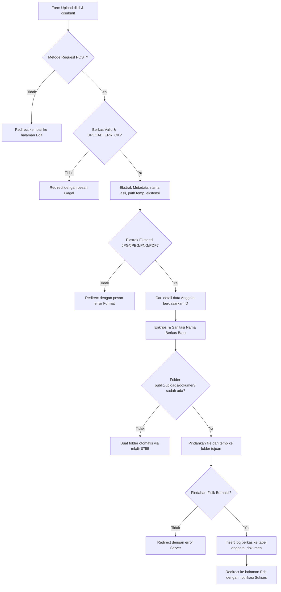

# 🛠️ Alur Penyimpanan Berkas Kelengkapan Anggota (KTP, KK, Form Pengajuan)

Dokumen ini menjelaskan secara rinci alur kerja (workflow) langkah-demi-langkah penyimpanan, penayangan, dan penghapusan berkas fisik kelengkapan anggota seperti **KTP**, **KK (Kartu Keluarga)**, dan **Form Pengajuan Pinjaman** dalam sistem Informasi Koperasi Harapan Mulya.

---

## 📂 1. Arsitektur Penyimpanan & Database

Sistem memisahkan penyimpanan fisik berkas dari pencatatan informasi di database untuk menjaga keamanan, efisiensi, dan performa aplikasi.

### A. Folder Fisik Server
* **Direktori Utama:** `public/uploads/dokumen/`
* **Keamanan:** Folder ini dilindungi oleh hak akses standar (`0755`) untuk memastikan hanya server web yang dapat menulis dan mengeksekusi berkas di dalamnya.

### B. Tabel Database (`anggota_dokumen`)
Relasi antara data profil anggota dengan berkas fisiknya dikelola melalui tabel relasional berikut:

| Nama Kolom | Tipe Data | Deskripsi |
| :--- | :--- | :--- |
| `anggota_id` | INT (FK) | Relasi ke tabel `anggota` dengan skema `ON DELETE CASCADE` (jika anggota dihapus, berkas otomatis ikut terhapus). |
| `jenis_dokumen` | VARCHAR / ENUM | Menentukan kategori dokumen (`ktp`, `perjanjian`, `pengajuan`, dll). |
| `nama_file` | VARCHAR | Nama berkas unik yang tersimpan di server (`{jenis}_{no_anggota}_{timestamp}.{ext}`). |

---

## 🔄 2. Langkah-Demi-Langkah Alur Penyimpanan (Upload Flow)

Proses pengunggahan dokumen kelengkapan dilakukan melalui halaman **Edit Anggota** (`/anggota/{id}/edit`). Berikut adalah alur prosesnya dari hulu ke hilir di backend (`AnggotaController@uploadDokumen`):



### Langkah Detail Backend:

1. **Verifikasi Request POST:**
   Sistem memastikan bahwa permintaan dikirim melalui metode `POST`. Jika diakses tidak sah, pengguna langsung dilempar kembali.
2. **Validasi Ketersediaan Berkas:**
   Backend membaca global array `$_FILES['berkas_dokumen']` dan memeriksa apakah status error bernilai `UPLOAD_ERR_OK` (file sukses dikirim oleh browser).
3. **Pemeriksaan Format Berkas (Ekstensi):**
   * Ekstensi diekstrak menggunakan `pathinfo($fileName, PATHINFO_EXTENSION)` dan diubah ke huruf kecil (`strtolower`).
   * **Format yang diizinkan:** `.jpg`, `.jpeg`, `.png`, dan `.pdf`.
   * Jika di luar format tersebut, sistem menolak pengunggahan dan menampilkan alert SweetAlert2.
4. **Pencarian Data Anggota:**
   Sistem memuat data profil anggota berdasarkan `anggota_id` untuk mendapatkan informasi Nomor Anggota (`no_anggota`).
5. **Sanitasi & Enkripsi Nama Berkas (Penamaan Unik):**
   Untuk mencegah duplikasi nama file sejenis dan potensi eksploitasi keamanan, nama berkas dienkripsi dengan format berikut:
   $$\text{Nama Berkas} = \text{jenis\_dokumen} + \text{"\_"} + \text{no\_anggota\_sanitized} + \text{"\_"} + \text{timestamp} + \text{"."} + \text{ekstensi}$$
   * *Contoh:* Jika anggota dengan Nomor Anggota `A001` mengunggah `KTP` pada timestamp saat itu, nama file menjadi: `ktp_A001_1779075104491.pdf`.
6. **Pembuatan Folder Otomatis (Autocreate Folder):**
   Sistem memeriksa apakah direktori `public/uploads/dokumen/` telah dibuat di server web. Jika belum, sistem mengeksekusi perintah pembuatan folder secara dinamis dengan hak akses `0755` (`mkdir($uploadFileDir, 0755, true)`).
7. **Pemindahan Berkas Fisik ke Server:**
   File dipindahkan dari folder temporer PHP ke folder resmi server menggunakan fungsi `move_uploaded_file()`.
8. **Pencatatan Database:**
   Setelah berkas fisik tersimpan, query `INSERT INTO anggota_dokumen (anggota_id, jenis_dokumen, nama_file)` dieksekusi untuk merekam relasi berkas tersebut.

---

## 🗑️ 3. Langkah-Demi-Langkah Alur Penghapusan (Delete Flow)

Penghapusan berkas kelengkapan dapat dipicu oleh admin (`AnggotaController@deleteDokumen`) untuk memperbarui berkas lama. Proses ini menjamin kebersihan memori server:

1. **Verifikasi POST Request:** Sistem hanya menerima perintah hapus lewat `POST` demi keamanan.
2. **Pencarian Nama Berkas di Database:**
   Sistem mengambil nama file berdasarkan `anggota_id` dan `jenis_dokumen` dari tabel `anggota_dokumen`.
3. **Penghapusan Berkas Fisik (Server Disk Cleanup):**
   * Sistem memeriksa keberadaan berkas fisik di server (`public/uploads/dokumen/{nama_file}`).
   * Jika berkas fisik ada, fungsi PHP `unlink($filePath)` dijalankan untuk **menghapus berkas dari disk server secara permanen**.
4. **Penghapusan Rekaman Database:**
   Query `DELETE FROM anggota_dokumen WHERE anggota_id = ? AND jenis_dokumen = ?` dieksekusi agar database kembali bersih.

---

## 👁️ 4. Alur Penayangan Dokumen (View/Preview Flow)

Saat admin ingin memvalidasi berkas anggota, mereka mengklik tombol "Lihat Dokumen" di halaman **Detail Anggota** (`/anggota/{id}`):

1. Rute `/anggota/dokumen/{id}/{jenis_dokumen}` mendeteksi permintaan peninjauan berkas.
2. Sistem mencari nama file di tabel database `anggota_dokumen`.
3. Informasi diteruskan ke template view `views/anggota/view_dokumen.php`.
4. Jika berkas berformat gambar (`.jpg`/`.png`), antarmuka memunculkan elemen HTML ``. Jika berkas berformat dokumen `.pdf`, antarmuka memunculkan elemen `<embed>` bergaya interaktif untuk mempermudah pemeriksaan dokumen oleh Validator/Manager tanpa perlu mengunduh file terlebih dahulu.

---

## 📝 5. Cara Menambahkan Berkas Baru (Misalnya: KK / Kartu Keluarga)

Jika ke depan Anda ingin secara khusus menambahkan dokumen baru seperti **KK (Kartu Keluarga)**, ikuti 3 langkah mudah ini:

### Langkah A - Daftarkan Label Baru di `AnggotaController.php`
Buka file `app/controllers/AnggotaController.php`, cari fungsi `lihatDokumen` (sekitar baris 238) dan daftarkan penamaan barunya:
```php
if ($jenisDokumen === 'kk') $labelDokumen = 'Kartu Keluarga';
```

### Langkah B - Tambahkan Form Input Baru di `views/anggota/edit.php`
Tambahkan form input untuk Kartu Keluarga di halaman pengeditan agar admin dapat memilih berkas KK untuk diunggah:
```html
<input type="hidden" name="jenis_dokumen" value="kk">
```

### Langkah C - Hubungkan Tombol Aksi di halaman `views/anggota/detail.php`
Tambahkan tombol pratinjau KK di halaman detail profil anggota agar Validator/Manager dapat mengkliknya langsung:
```html
<a href="<?= url('/anggota/dokumen/' . $anggota['id'] . '/kk') ?>" class="btn btn-sm btn-info">Lihat KK</a>
```
