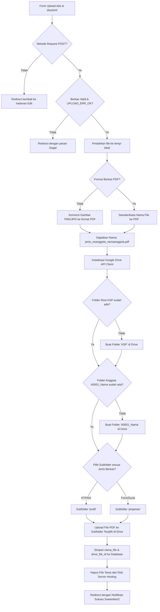

# 🛠️ Alur Penyimpanan Berkas KSP & Integrasi Google Drive + Auto-PDF

Dokumen ini menjelaskan secara rinci alur kerja (workflow) langkah-demi-langkah penyimpanan, penayangan, konversi otomatis, dan sinkronisasi Google Drive untuk berkas kelengkapan anggota seperti **KTP**, **KK (Kartu Keluarga)**, **Form Pengajuan Pinjaman**, dan **Surat Perjanjian** dalam sistem Informasi Koperasi Harapan Mulya.

---

## 📸 Infografis Arsitektur Pipeline

Berikut adalah visualisasi tingkat tinggi alur pemrosesan dokumen dari validator hingga ke Google Drive cloud:


---

## 📂 1. Arsitektur Penyimpanan & Database

Sistem mengadopsi model **Cloud Storage Hybrid**, di mana penyimpanan fisik dilakukan di Google Drive untuk keandalan dan kapasitas tak terbatas, sedangkan database lokal menyimpan referensi metadata berkas.

### A. Folder Fisik Lokal (Temporary)
* **Direktori Utama:** `public/uploads/temp/`
* **Fungsi:** Menyimpan file unggahan sementara selama proses konversi ke PDF berlangsung. Setelah sukses diunggah ke Google Drive, berkas di folder ini akan segera dihapus (`unlink()`) demi menjaga space hosting lokal.

### B. Skema Tabel Database (`anggota_dokumen`)
Relasi data anggota dengan berkas di Google Drive dikelola melalui tabel `anggota_dokumen` dengan penyesuaian kolom `drive_file_id`:

| Nama Kolom | Tipe Data | Deskripsi |
| :--- | :--- | :--- |
| `anggota_id` | INT (FK) | Relasi ke tabel `anggota` dengan skema `ON DELETE CASCADE`. |
| `jenis_dokumen` | VARCHAR / ENUM | Kategori dokumen (`ktp`, `kk`, `pengajuan`, `perjanjian`). |
| `nama_file` | VARCHAR | Nama berkas standar: `{jenis}_{no_anggota}_{nama}.pdf`. |
| `drive_file_id`| VARCHAR | **ID File Google Drive** murni sebagai referensi download/view. |

---

## 🔄 2. Langkah-Demi-Langkah Alur Penyimpanan (Upload & Convert Flow)

Proses pengunggahan dokumen dilakukan oleh Validator melalui menu Edit Profil Anggota. Berikut adalah alur proses backend (`AnggotaController@uploadDokumen`):



### Penjelasan Detail Tiap Tahap:

1. **Konversi Format Otomatis:**
   * Jika file yang dikirim adalah format gambar (`.jpg`, `.jpeg`, `.png`), sistem memanggil parser (misal FPDF/Imagick) untuk mengubahnya menjadi file `.pdf` murni agar seragam.
2. **Standardisasi Nama Berkas:**
   * File diubah menjadi lowercase dan disesuaikan penamaannya: `{jenis}_{no_anggota}_{nama_anggota}.pdf` (Contoh: `ktp_a0001_budi_santoso.pdf`).
3. **Pengecekan Folder Bertingkat di Google Drive:**
   * **Root Level:** Mengecek folder bernama `KSP` di Drive. Jika tidak ada, folder dibuat.
   * **Member Level:** Mengecek folder `{no_anggota}_{nama_anggota}` di bawah folder `KSP`.
   * **Sub-folder Level:**
     * File KTP & KK diarahkan ke subfolder `profil`.
     * File Form Pengajuan & Surat Perjanjian diarahkan ke subfolder `pinjaman`.
4. **Pembersihan Hosting:**
   * Begitu Google Drive API mengembalikan `drive_file_id`, file lokal di server dihapus demi mengoptimalkan disk space.

---

## 🗑️ 3. Langkah-Demi-Langkah Alur Penghapusan (Delete & Sync Flow)

Jika admin menghapus berkas, sistem akan mensinkronisasikannya secara penuh ke Google Drive untuk menghindari berkas sampah (orphan files):

1. **Ambil Data Database:** Sistem membaca `drive_file_id` dari tabel `anggota_dokumen` berdasarkan `anggota_id` dan `jenis_dokumen`.
2. **Hapus Berkas dari Google Drive:**
   * Sistem mengirimkan request `delete` ke Google Drive API menggunakan `drive_file_id` yang terdaftar.
   * File akan terhapus secara permanen atau dipindahkan ke Sampah (Trash) di Google Drive.
3. **Hapus Rekaman Database:** Query `DELETE FROM anggota_dokumen WHERE anggota_id = ? AND jenis_dokumen = ?` dieksekusi setelah penghapusan cloud berhasil.

---

## 👁️ 4. Alur Penayangan Dokumen (Preview/View Flow)

Untuk meminimalkan bandwidth server lokal, penayangan pratinjau (preview) dokumen memanfaatkan viewer Google Drive secara aman:

1. **Permintaan Preview:** Admin mengklik "Lihat Dokumen" pada data anggota.
2. **Kueri Database:** Mendapatkan `drive_file_id` berkas terkait.
3. **Generasi Secure URL:**
   * Sistem menghasilkan URL pratinjau yang aman (misalnya memanfaatkan link `https://drive.google.com/file/d/{drive_file_id}/preview` atau tautan unduhan yang dialirkan via proxy stream di PHP controller).
4. **Rendisi Antarmuka:** Dokumen langsung dirender dalam elemen `<iframe src="..." width="100%" height="600px">` atau `<embed>` interaktif yang nyaman dibaca oleh Validator.

---

## 📝 5. Panduan Pengembangan & Pengujian

### Prasyarat Library (Composer Dependencies)
```bash
composer require google/apiclient:^2.15
composer require dompdf/dompdf
```

### Kunci Sukses Keamanan
* File kredensial Google Service Account (`google-credentials.json`) disimpan di folder luar webroot (misal `/storage/app/`) dan terdaftar di `.gitignore` untuk mencegah kebocoran kunci keamanan.
