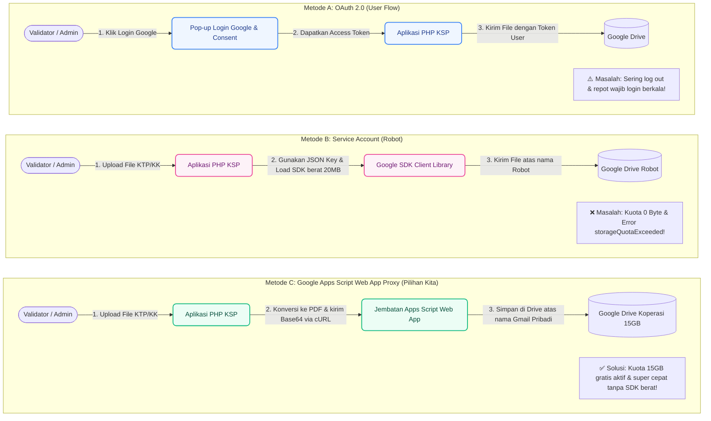

# 🧠 Analisis Perbandingan Teknologi Penyimpanan Google Drive KSP Harapan Mulya
*(Mengapa Google Apps Script Web App Proxy Adalah Pilihan Terbaik?)*

Dokumen ini disusun untuk menjelaskan latar belakang teknis transisi arsitektur penyimpanan file cloud di **KSP Harapan Mulya**. Di sini kami membandingkan tiga metode utama integrasi Google Drive API: **OAuth 2.0 (User Flow)**, **Google Service Account (Robot)**, dan **Google Apps Script Web App Proxy** (yang kita gunakan saat ini), lengkap dengan kelebihan, kekurangan, serta visualisasi alur masing-masing.

---

## 📊 1. Tabel Perbandingan Cepat

| Kriteria Analisis | Metode A: OAuth 2.0 (User Flow) | Metode B: Google Service Account | Metode C: Apps Script Proxy (Pilihan Kita) |
| :--- | :--- | :--- | :--- |
| **Kapasitas Kuota** | Menggunakan kuota akun pengguna masing-masing (15 GB gratis). | **0 Byte (Limit Akun Robot Modern)** memicu error kuota. | **15 GB Gratis** (Menggunakan kuota akun Gmail Koperasi Anda). |
| **Beban Server Backend** | Ringan (cURL / SDK). | **Sangat Berat** (Wajib install SDK Google Client API ~20MB+). | **Sangat Ringan** (Menggunakan cURL native PHP, tanpa SDK tambahan). |
| **Interaksi Pengguna (UX)** | **Buruk** (Validator/Admin wajib login Google berkala saat token habis). | **Sempurna** (Berjalan otomatis di backend tanpa interaksi user). | **Sempurna** (Berjalan otomatis di backend secara instan tanpa interaksi user). |
| **Kemudahan Konfigurasi** | Rumit (Butuh Google Cloud Console, Client ID, Redirect URI). | Sangat Rumit (Butuh GCP Console, pembuatan Key JSON, Sharing Folder). | **Sangat Sederhana** (Hanya copy-paste script ke script.google.com & deploy). |
| **Solusi Bug Multi-Login** | Rentan (Sering memicu error 403 jika admin login beberapa akun Gmail). | Rentan (Membutuhkan penanganan hak akses manual yang rumit). | **Terselesaikan Otomatis** (Apps Script langsung mengatur izin sharing publik otomatis). |

---

## 🎨 2. Gambar Arsitektur & Alur Kerja (Mermaid Diagram)

Berikut visualisasi perbedaan alur kerja antara ketiga metode tersebut untuk memahami mengapa metode **Google Apps Script Proxy** jauh lebih unggul dan efisien:

---

## 🔍 3. Kupas Tuntas Setiap Metode

### 1️⃣ Metode A: OAuth 2.0 (User Authentication Flow)
Metode ini adalah cara standar dari Google agar aplikasi web dapat mengakses data atas nama pengguna asli yang sedang aktif menggunakan akun Google mereka.
*   **Kelebihan:**
    *   Sangat aman karena pengguna menentukan hak akses secara manual.
    *   Penyimpanan file langsung menggunakan kuota 15 GB milik masing-masing pengguna yang login.
*   **Kekurangan Fatal:**
    *   **Merusak User Experience (UX):** Administrator atau Validator Koperasi harus terus-menerus melakukan verifikasi login Google setiap kali `access_token` kedaluwarsa atau sesi terputus. Ini sangat mengganggu operasional harian koperasi.
    *   **Tidak Ramah Otomasi Backend:** Sistem tidak dapat melakukan proses otomatis di latar belakang (misalnya, autodebet atau pembersihan file sampah di Drive tengah malam) jika admin sedang offline, karena otentikasi membutuhkan tombol klik manusia secara real-time.

---

### 2️⃣ Metode B: Google Service Account (Akun Robot)
Service Account adalah akun virtual non-manusia yang bertindak sebagai "robot" untuk integrasi antar-server (*server-to-server connection*) tanpa membutuhkan login pengguna.
*   **Kelebihan:**
    *   Sepenuhnya berjalan otomatis di backend tanpa perlu klik verifikasi login dari Admin.
    *   Otentikasi menggunakan berkas enkripsi kunci pribadi (JSON Key) yang sangat kuat.
*   **Kekurangan Fatal:**
    *   **Kuota 0 Byte Google Modern:** Kebijakan terbaru dari Google Cloud membatasi kuota penyimpanan untuk akun robot baru menjadi **0 Byte**. Hal ini langsung memicu kegagalan sistem saat validator mengunggah gambar/PDF kecil sekalipun dengan pesan error: `storageQuotaExceeded`.
    *   **Beban SDK Terlalu Berat:** Server Laragon/Hosting Anda wajib menampung library resmi `google/apiclient` berbobot **20 Megabyte ke atas** yang berisi ribuan berkas PHP. Hal ini membuat waktu pemrosesan server menjadi lebih lambat dan memakan memori RAM server hosting.
    *   **Konfigurasi Super Rumit:** Admin koperasi non-teknis dipaksa untuk belajar membuat project Google Cloud Platform (GCP), mengaktifkan API Drive, mengunduh file JSON Kredensial, dan membagikan folder Drive secara manual kepada email robot tersebut.

---

### 3️⃣ Metode C: Google Apps Script Web App Proxy (Mengapa Kita Memilih Ini?)
Metode modern ini menggunakan script JavaScript super ringan (`doPost(e)`) yang ditanam langsung di dalam lingkungan internal Google Drive Anda melalui Google Apps Script, kemudian dipublikasikan sebagai endpoint Web App API mandiri.
*   **Alasan Utama Memilih Metode Ini:**
    1.  **Melompati (Bypass) Limit Kuota 0 Byte:** Karena Google Apps Script berjalan secara otonom di bawah akun Gmail pribadi Koperasi Anda (`koperasiharapanmulyaunp@gmail.com`), seluruh dokumen yang dikirimkan oleh sistem Laragon KSP akan secara sah menumpang pada kuota gratis **15 Gigabyte** milik Gmail pribadi Anda! Anda mendapatkan penyimpanan gratis super besar tanpa mengeluarkan biaya sepeser pun.
    2.  **Performa Kilat Tanpa SDK Berat:** Menghapus 100% pustaka Google Client API PHP dari server hosting Koperasi Anda. Aplikasi PHP kini cukup mengirimkan data berkas terenkripsi Base64 menggunakan fungsi **cURL Native PHP** bawaan hosting yang hanya berukuran beberapa baris kode, sehingga loading halaman menjadi jauh lebih instan.
    3.  **Pengalaman Pengguna (UX) yang Mulus:** Sistem pengunggahan berjalan di belakang layar secara transparan. Validator tidak akan pernah melihat jendela pop-up login Google atau dipaksa melakukan otorisasi berulang kali.
    4.  **Bebas Bug Error 403 (Multi-Akun Google):** Pada metode biasa, jika Admin sedang membuka banyak tab Gmail pribadi lain di browser mereka, Google sering mengalami konflik akun dan memunculkan error *403 Forbidden* saat mencoba membuka pratinjau dokumen. Apps Script mem-bypass masalah ini dengan langsung menandai dokumen yang sukses terunggah sebagai *"Anyone with link (Viewer)"*, sehingga pratinjau dokumen di dashboard KSP bekerja mulus 100%.
    5.  **Instalasi Singkat:** Tidak memerlukan pembuatan project Google Cloud yang berbelit-belit. Cukup menyalin kode script ke Google Apps Script, klik tombol deploy sekali, dan proyek Anda langsung terintegrasi secara aman dengan enkripsi Token Pengaman.

---

## 🏆 Kesimpulan Arsitektur KSP Harapan Mulya
Dengan beralih menggunakan **Google Apps Script Web App Proxy**, sistem koperasi kita kini memiliki fondasi penyimpanan berkas yang **gratis, berkapasitas besar (15GB), super ringan bagi server hosting, bebas hambatan interaksi admin, dan kebal terhadap kendala kuota modern Google**. 

Ini adalah solusi cerdas untuk menyajikan aplikasi kelas korporat yang hemat biaya namun tetap memiliki tingkat kehandalan dan keamanan data yang sangat tinggi.
