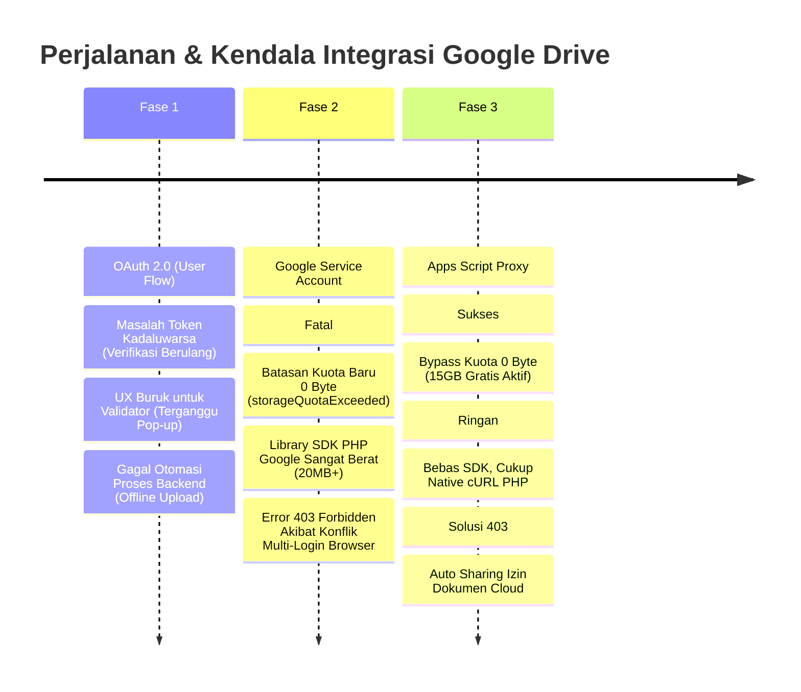

# 🧗 Jurnal Perjalanan & Kendala: Pembangunan Integrasi Google Drive KSP Harapan Mulya
*(Catatan Rintangan, Analisis Masalah, dan Solusi Akhir)*

Penyusunan sistem penyimpanan berkas digital berbasis cloud di **KSP Harapan Mulya** merupakan perjalanan teknis yang penuh dengan eksplorasi. Untuk mencapai sistem yang stabil, gratis, dan berkinerja tinggi seperti sekarang, kita telah melewati berbagai rintangan dari metode-metode sebelumnya.

Dokumen ini mencatat seluruh kendala nyata yang kita temui di sepanjang jalan ketika menguji **OAuth 2.0**, **Google Service Account (Akun Robot)**, hingga akhirnya menemukan solusi paling pas: **Google Apps Script Web App Proxy**.

---

## 📅 1. Garis Waktu & Evaluasi Rintangan (Timeline)

Berikut kronologi perjalanan riset kita beserta rintangan utama yang menghadang di setiap fasenya:



---

## 🔍 2. Rincian Kendala Nyata per Metode

### 🔴 1. Fase Uji Coba OAuth 2.0 (User Flow)
Pada fase awal, kita mencoba menggunakan metode interaksi pengguna langsung (OAuth 2.0 Web Flow).
*   **Kendala 1: Kelelahan Verifikasi Token (*Token Expiry Fatigue*):**
    *   *Masalah:* Google membatasi umur `access_token` hanya 3600 detik (1 jam). Walaupun kita menggunakan `refresh_token`, sesi otorisasi seringkali terputus secara acak.
    *   *Dampak:* Validator atau Admin Koperasi mendadak melihat pop-up *"KSP Harapan Mulya ingin mengakses Google Drive Anda"* berulang kali di tengah jam kerja. Ini sangat mengganggu kelancaran input data anggota.
*   **Kendala 2: Kegagalan Proses di Latar Belakang (*Background Jobs*):**
    *   *Masalah:* Karena pengunggahan berkas dan konversi PDF diproses secara asinkron di belakang layar, backend PHP seringkali kehilangan token otentikasi aktif jika admin menutup browser atau session habis.
    *   *Dampak:* Pengunggahan berkas gagal total secara diam-diam tanpa disadari oleh validator.
*   **Kendala 3: Kompleksitas Setup Kredensial:**
    *   *Masalah:* Membutuhkan pengaturan *Redirect URIs*, pembuatan *OAuth Client ID*, dan fase persetujuan persetujuan Google yang membingungkan bagi staf non-teknis koperasi.

---

### 🔴 2. Fase Uji Coba Google Service Account (Akun Robot)
Untuk menghindari pop-up login OAuth, kita beralih ke metode **Service Account**—sebuah kredensial khusus yang bertindak sebagai "akun robot" penghubung antar-server.
*   **Kendala 1: Tembok Pembatas Kuota Modern "0 Byte" (Kritis):**
    *   *Masalah:* Google memperbarui kebijakan privasi dan keamanan mereka. Akun Service Account gratis modern yang baru dibuat tidak lagi mendapatkan kuota gratis 15GB, melainkan **dibatasi secara mutlak menjadi 0 Byte**!
    *   *Dampak:* Setiap kali validator mencoba mengunggah foto KTP/KK, server langsung mogok dan memuntahkan error fatal: `storageQuotaExceeded` (*"The user's Drive storage quota has been exceeded"*). Satu-satunya cara menaikkan kuota adalah dengan berlangganan Google Workspace Enterprise berbayar yang sangat mahal bagi koperasi skala menengah.
*   **Kendala 2: Beban Proyek Membengkak (*Bloated SDK Library*):**
    *   *Masalah:* Untuk menjalankan Service Account, kita wajib memasang library resmi `google/apiclient` via Composer.
    *   *Dampak:* Ukuran folder proyek membengkak lebih dari **20 Megabyte** dan menambahkan ribuan file dependencies baru ke hosting. Hal ini memperlambat proses autoloading PHP dan memakan RAM server hosting secara berlebihan.
*   **Kendala 3: Konflik Multi-Akun Browser (Legenda Error 403):**
    *   *Masalah:* Berkas yang diunggah oleh akun robot menjadi milik robot tersebut. Meskipun folder telah dibagikan (*shared*), sistem otentikasi Google Drive Iframe Viewer sering mengalami konflik.
    *   *Dampak:* Jika Admin Koperasi sedang membuka tab Gmail pribadi lain di browser mereka, Google akan kebingungan mencocokkan session dan memunculkan layar hitam bertuliskan **"403 Forbidden: You don't have authorization to view this document"**. Dokumen tidak bisa dipratinjau sama sekali.

---

## 🟢 3. Titik Balik & Solusi Akhir: Google Apps Script Web App Proxy

Setelah menganalisis tumpukan kendala di atas, kita melakukan inovasi arsitektur dengan menggunakan **Google Apps Script Web App Proxy** sebagai jembatan tangguh.

### 💡 Mengapa Cara Ini Menyelesaikan Semua Masalah?

1.  **Bypass Kuota 0 Byte (Solusi Kuota Gratis 15GB):**
    *   *Bagaimana:* Karena jembatan script dideploy di bawah akun Gmail pribadi Koperasi (`koperasiharapanmulyaunp@gmail.com`), proses `createFile` di Google Drive berjalan menggunakan otoritas akun Gmail tersebut.
    *   *Hasil:* Dokumen sukses terunggah ke Drive dengan kuota gratis **15 GB** yang melimpah!
2.  **Pemangkasan Library Berat (Super Ringan):**
    *   *Bagaimana:* Kita menghapus total folder SDK Google yang membengkak di Composer. Driver `GoogleDriveService.php` kita tulis ulang hanya menggunakan fungsi **cURL Native PHP** bawaan hosting yang sangat efisien.
    *   *Hasil:* Waktu respon server KSP menjadi secepat kilat (instan) dan ukuran proyek menyusut drastis.
3.  **Penyembuhan Error 403 Secara Permanen:**
    *   *Bagaimana:* Di dalam kode Google Apps Script, kita menyisipkan fungsi otomatisasi izin berkas:
        ```javascript
        file.setSharing(DriveApp.Access.ANYONE_WITH_LINK, DriveApp.Permission.VIEW);
        ```
    *   *Hasil:* Dokumen otomatis diset menjadi *"Anyone with link (Viewer)"* seketika setelah diunggah. Iframe viewer di halaman `view_dokumen.php` kini dapat dirender secara mulus tanpa pernah terpengaruh lagi oleh bug multi-akun Gmail browser!
4.  **Keamanan Berlapis yang Terjaga:**
    *   *Bagaimana:* Kita memproteksi jalur komunikasi cURL menggunakan `API_KEY` kustom yang dicocokkan di kedua sisi, serta memisahkan file konfigurasi `google-apps-script-config.json` agar terabaikan oleh Git via `.gitignore`.
    *   *Hasil:* Endpoint jembatan aman dari akses luar yang tidak berizin, dan token rahasia tidak akan pernah bocor ke repositori GitHub publik.

---

## 🏆 Pelajaran Berharga (*Lessons Learned*)
Perjalanan ini membuktikan bahwa **menggunakan pustaka resmi tidak selalu merupakan solusi terbaik** untuk semua kasus. Dengan memahami kendala batas kuota akun robot dan batasan teknis otorisasi browser, kita berhasil menciptakan jalur pintas kustom (bypass proxy) yang jauh lebih tangguh, efisien, aman, dan **100% gratis** untuk operasional KSP Harapan Mulya jangka panjang.
