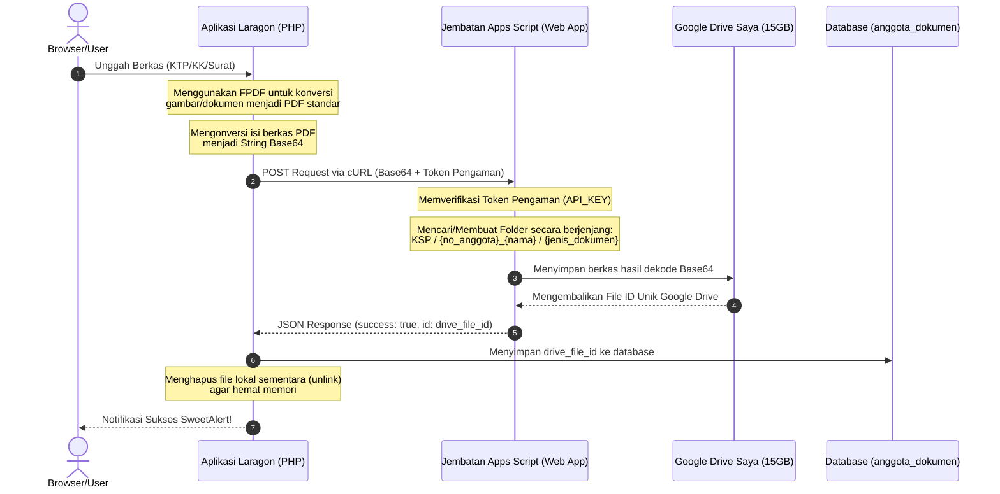

# 🧭 Panduan Lengkap & Walkthrough Integrasi Google Drive via Google Apps Script (Bypass Kuota 0 Byte)

Dokumen ini memuat panduan lengkap dari **nol (0)** hingga sistem berjalan penuh untuk integrasi penyimpanan berkas Koperasi Harapan Mulya ke cloud Google Drive Anda menggunakan metode **Google Apps Script Web App Proxy**.

---

## 🏗️ 1. Latar Belakang & Arsitektur Jembatan

### Mengapa Menggunakan Google Apps Script?
Sebelumnya, sistem menggunakan **Service Account (Akun Robot)** bawaan Google Cloud Console. Namun, Google membatasi kuota penyimpanan Service Account akun personal menjadi **0 byte**, sehingga terjadi error `storageQuotaExceeded` meskipun Google Drive pribadi Anda masih kosong 15 GB.

Dengan metode baru ini, kita membuat **"Jembatan Aplikasi"** menggunakan **Google Apps Script** yang berjalan langsung di bawah akun Gmail pribadi Anda (`koperasiharapanmulyaunp@gmail.com`). Skrip ini bertindak sebagai API Proxy sehingga semua operasi unggah file menggunakan kuota gratis 15 GB milik Drive pribadi Anda sendiri.

### 📊 Alur Kerja Integrasi Penyimpanan Dokumen:



---

## 🛠️ 2. Komponen Kode di Sisi Aplikasi (PHP)

Ada dua file utama yang dibuat dan dikonfigurasi di dalam proyek Laragon Anda:

### 📄 A. Berkas Konfigurasi
Path: [google-apps-script-config.json](file:///c:/laragon/www/Ksp_Koperasinat/storage/app/google-apps-script-config.json)

Berkas ini menyimpan konfigurasi endpoint Web App jembatan Apps Script Anda dan Token Pengaman (`api_key`):

```json
{
    "web_app_url": "https://script.google.com/macros/s/AKfycbx8OXUc1mUrPHU2wVEhdTzCaBmNBvRBjR9RHqMBCQNilYT1zwTs9w_vkNl2f43XO3C9/exec",
    "api_key": "ksp_harapan_mulya_secure_token"
}
```

### 📄 B. Class Driver Integrasi
Path: [GoogleDriveService.php](file:///c:/laragon/www/Ksp_Koperasinat/app/services/GoogleDriveService.php)

Class ini bertindak sebagai driver utama untuk berkomunikasi dengan Google Apps Script Web App menggunakan **cURL**. Class ini mempertahankan signature method lama agar controller Anda tetap bekerja tanpa perubahan code apa pun:

```php
<?php
/**
 * GoogleDriveService
 * Mengintegrasikan sistem koperasi dengan Google Drive via Google Apps Script Web App Proxy
 */

class GoogleDriveService {
    private $webAppUrl;
    private $apiKey;

    public function __construct() {
        $configPath = ROOT_PATH . '/storage/app/google-apps-script-config.json';
        if (!file_exists($configPath)) {
            throw new Exception("Berkas konfigurasi Google Apps Script ('google-apps-script-config.json') tidak ditemukan.");
        }

        $config = json_decode(file_get_contents($configPath), true);
        if (empty($config['web_app_url'])) {
            throw new Exception("URL Web App Google Apps Script belum dikonfigurasi di google-apps-script-config.json.");
        }

        $this->webAppUrl = $config['web_app_url'];
        $this->apiKey = isset($config['api_key']) ? $config['api_key'] : '';
    }

    /**
     * Melakukan request cURL ke Google Apps Script Web App dengan mengikuti Redirect (HTTP 302)
     */
    private function sendRequest($params) {
        $params['key'] = $this->apiKey;
        
        $ch = curl_init();
        curl_setopt($ch, CURLOPT_URL, $this->webAppUrl);
        curl_setopt($ch, CURLOPT_POST, true);
        curl_setopt($ch, CURLOPT_POSTFIELDS, http_build_query($params));
        curl_setopt($ch, CURLOPT_RETURNTRANSFER, true);
        curl_setopt($ch, CURLOPT_FOLLOWLOCATION, true); // SANGAT PENTING: Mengikuti redirect 302 Google Web App
        curl_setopt($ch, CURLOPT_TIMEOUT, 60); 

        $response = curl_exec($ch);
        $httpCode = curl_getinfo($ch, CURLINFO_HTTP_CODE);
        
        if (curl_errno($ch)) {
            $errorMsg = curl_error($ch);
            curl_close($ch);
            throw new Exception("Koneksi ke Apps Script gagal (cURL Error): " . $errorMsg);
        }
        
        curl_close($ch);

        if ($httpCode !== 200) {
            throw new Exception("Respons server Google Apps Script tidak valid (HTTP " . $httpCode . ").");
        }

        $result = json_decode($response, true);
        if (!$result) {
            throw new Exception("Gagal mendekode respons JSON dari Google Apps Script: " . $response);
        }

        if (isset($result['success']) && $result['success'] === false) {
            throw new Exception("Error dari Google Apps Script: " . (isset($result['error']) ? $result['error'] : 'Unknown error'));
        }

        return $result;
    }

    /**
     * Mendapatkan ID folder jika sudah ada, atau membuat folder baru jika belum ada
     */
    public function getOrCreateFolder($folderName, $parentFolderId = null) {
        $params = [
            'action' => 'getOrCreateFolder',
            'folderName' => $folderName
        ];
        if ($parentFolderId) {
            $params['parentFolderId'] = $parentFolderId;
        }

        $result = $this->sendRequest($params);
        return $result['id'];
    }

    /**
     * Mengunggah berkas lokal ke Google Drive pada folder tertentu
     */
    public function uploadFile($filePath, $fileName, $parentFolderId) {
        if (!file_exists($filePath)) {
            throw new Exception("Berkas lokal tidak ditemukan di: " . $filePath);
        }

        $content = file_get_contents($filePath);
        $base64Data = base64_encode($content);

        $params = [
            'action' => 'uploadFile',
            'fileName' => $fileName,
            'parentFolderId' => $parentFolderId,
            'mimeType' => 'application/pdf',
            'data' => $base64Data
        ];

        $result = $this->sendRequest($params);
        return $result['id'];
    }

    /**
     * Menghapus berkas dari Google Drive berdasarkan ID berkas
     */
    public function deleteFile($driveFileId) {
        try {
            $params = [
                'action' => 'deleteFile',
                'driveFileId' => $driveFileId
            ];
            $this->sendRequest($params);
            return true;
        } catch (Exception $e) {
            error_log("Gagal menghapus berkas di Google Drive ID {$driveFileId}: " . $e->getMessage());
            return false;
        }
    }
}
```

---

## 🖥️ 3. Kode Google Apps Script (GAS)

Kode JavaScript di bawah ini ditanam di Google Apps Script Anda untuk melayani request API dari aplikasi PHP:

```javascript
// Token Pengaman - Harus 100% sama dengan yang tertulis di google-apps-script-config.json
var API_KEY = "ksp_harapan_mulya_secure_token";

function doPost(e) {
  var result = {};
  try {
    // 1. Validasi Akses
    var clientKey = e.parameter.key;
    if (clientKey !== API_KEY) {
      throw new Error("Akses Ditolak: Token Pengaman Tidak Valid.");
    }

    var action = e.parameter.action;
    
    // AKSI 1: Dapatkan ID Folder atau buat baru jika belum ada
    if (action === 'getOrCreateFolder') {
      var folderName = e.parameter.folderName;
      var parentFolderId = e.parameter.parentFolderId;
      
      var parentFolder;
      if (parentFolderId) {
        parentFolder = DriveApp.getFolderById(parentFolderId);
      } else {
        parentFolder = DriveApp.getRootFolder();
      }
      
      var folders = parentFolder.getFoldersByName(folderName);
      if (folders.hasNext()) {
        result.id = folders.next().getId();
      } else {
        var folder = parentFolder.createFolder(folderName);
        result.id = folder.getId();
      }
      result.success = true;
      
    // AKSI 2: Unggah dan buat berkas baru dari Base64
    } else if (action === 'uploadFile') {
      var fileName = e.parameter.fileName;
      var parentFolderId = e.parameter.parentFolderId;
      var mimeType = e.parameter.mimeType || 'application/pdf';
      var base64Data = e.parameter.data;
      
      var decoded = Utilities.base64Decode(base64Data);
      var blob = Utilities.newBlob(decoded, mimeType, fileName);
      
      var parentFolder = DriveApp.getFolderById(parentFolderId);
      var file = parentFolder.createFile(blob);
      
      // Mengatur izin sharing agar berkas dapat di-preview dan diunduh (Bypass 403 Multi-Login)
      file.setSharing(DriveApp.Access.ANYONE_WITH_LINK, DriveApp.Permission.VIEW);
      
      result.id = file.getId();
      result.success = true;
      
    // AKSI 3: Hapus Berkas (Pindahkan ke Sampah/Trash)
    } else if (action === 'deleteFile') {
      var driveFileId = e.parameter.driveFileId;
      var file = DriveApp.getFileById(driveFileId);
      file.setTrashed(true);
      result.success = true;
      
    } else {
      throw new Error('Aksi tidak dikenal: ' + action);
    }
    
  } catch (err) {
    result.success = false;
    result.error = err.toString();
  }
  
  return ContentService.createTextOutput(JSON.stringify(result))
    .setMimeType(ContentService.MimeType.JSON);
}
```

---

## 👣 4. Langkah Demi Langkah Pemasangan Jembatan (Dari 0)

Ikuti instruksi di bawah ini dengan seksama untuk menerapkan jembatan Google Apps Script Anda:

### 1️⃣ Langkah 1: Buat Proyek Skrip Baru
1. Buka browser dan pergi ke halaman dashboard **[script.google.com](https://script.google.com/)**.
   > [!IMPORTANT]
   > **Mencegah Bug Otorisasi Google:** Jika browser Anda sedang login ke lebih dari satu akun Google (multi-login), Anda **WAJIB** membuka tab **Incognito (Mode Penyamaran)** dan login *hanya* ke akun Gmail koperasi (`koperasiharapanmulyaunp@gmail.com`) untuk menghindari error *"Maaf, saat ini tidak dapat membuka file"* saat proses pemberian izin.
2. Klik tombol **New Project** di pojok kiri atas.
3. Klik pada tulisan *"Untitled project"* di bagian kiri atas, ketik nama proyek **`Jembatan Google Drive KSP`**, lalu klik **Rename**.

### 2️⃣ Langkah 2: Masukkan & Simpan Kode Skrip
1. Bersihkan seluruh kode template bawaan (fungsi `myFunction` kosong) dari dalam editor `Code.gs`.
2. Salin seluruh isi kode **Google Apps Script** pada **Poin 3** di atas, lalu tempelkan (paste) ke editor.
3. Simpan perubahan dengan menekan tombol **Save** (ikon disket) atau menekan `Ctrl + S`.

### 3️⃣ Langkah 3: Terapkan (Deploy) Sebagai Web App
1. Klik tombol **Deploy** di bagian kanan atas layar editor skrip, lalu pilih **New deployment**.
2. Klik tombol **Gir Pengaturan (Select type)** di samping tulisan *Select type*, lalu pilih **Web app**.
3. Atur parameter konfigurasi sebagai berikut:
   * **Description**: `Versi 1 - Jembatan Drive KSP`
   * **Execute as**: Pilih **Me (koperasiharapanmulyaunp@gmail.com)**
   * **Who has access**: Pilih **Anyone** (Ini wajib agar aplikasi PHP Laragon Anda dapat mengirimkan data tanpa login Google di sisi client cURL).
4. Klik tombol **Deploy** di bagian bawah jendela konfigurasi.

### 4️⃣ Langkah 4: Berikan Otorisasi Keamanan Google Drive
Karena skrip ini akan membuat folder dan menyimpan file langsung di Google Drive Anda, Google mewajibkan pemberian izin akses keamanan sekali saja:
1. Ketika pop-up bertuliskan *"Authorization Required"* muncul, klik tombol **Authorize Access**.
2. Pilih akun Google pribadi Anda (`koperasiharapanmulyaunp@gmail.com`).
3. Anda akan melihat halaman peringatan *"Google hasn't verified this app"*. Jangan panik, ini normal karena skrip ini Anda buat sendiri untuk keperluan pribadi. Klik tombol **Advanced** (Lanjutan) di bagian kiri bawah halaman.
4. Klik tautan bertuliskan **Go to Jembatan Google Drive KSP (unsafe)** di bagian bawah.
5. Pada halaman persetujuan akses Google Drive, klik **Allow** (Izinkan).

### 5️⃣ Langkah 5: Hubungkan URL Web App ke PHP Koperasi
1. Setelah proses deploy berhasil, sebuah kotak dialog akan muncul menampilkan data penerapan skrip.
2. Temukan kolom **Web app URL** yang berakhiran dengan `/exec`.
3. Klik tombol **Copy** di sebelah kanan URL tersebut.
4. Buka file konfigurasi Anda di folder Laragon:
   [google-apps-script-config.json](file:///c:/laragon/www/Ksp_Koperasinat/storage/app/google-apps-script-config.json)
5. Ganti nilai `"web_app_url"` dengan URL Web App yang baru saja Anda salin.
6. Simpan berkas konfigurasi tersebut (`Ctrl + S`).

---

## 🧪 5. Struktur Penyimpanan & Uji Coba Integrasi

### 📁 A. Struktur Folder Otomatis di Google Drive Anda
Setelah integrasi berjalan, setiap kali berkas diunggah, sistem akan secara otomatis membuat dan merapikan struktur folder secara teratur di halaman **Drive Saya** (Root Drive Anda):

```
Drive Saya / (Root)
└── KSP /                                         <-- Folder Induk Sistem
    └── {no_anggota}_{nama_anggota} /             <-- Folder Per Anggota (Contoh: A001_Ahmad_Rizki)
        ├── profil /                              <-- Kategori Profil (KTP, Kartu Keluarga, dll)
        │   └── ktp_A001_Ahmad_Rizki.pdf
        └── pinjaman /                            <-- Kategori Kredit/Pinjaman (Surat Perjanjian, dll)
            └── pengajuan_A001_Ahmad_Rizki.pdf
```

### 💾 B. Struktur Database Lokal
Data Google Drive dihubungkan ke sistem koperasi Anda melalui tabel `anggota_dokumen` dengan struktur record yang diperbarui seperti berikut:

| Column | Type | Description |
| :--- | :--- | :--- |
| `id` | INT (Primary Key) | ID unik data dokumen koperasi |
| `anggota_id` | INT | Relasi ke ID tabel `anggota` |
| `jenis_dokumen` | VARCHAR | Jenis dokumen (`ktp`, `kk`, `pengajuan`, `perjanjian`) |
| `nama_file` | VARCHAR | Nama berkas PDF yang disimpan lokal |
| `drive_file_id` | VARCHAR | **File ID unik dari Google Drive** (Contoh: `1lDflwloLRyVLOPUhB3zmkwKTNl6hdEsf`) |
| `created_at` | TIMESTAMP | Waktu unggah dokumen |

*Jika berkas berhasil diunggah ke Google Drive, kolom `drive_file_id` akan terisi secara otomatis, dan sistem akan langsung menampilkan preview file secara instan dan responsif saat tombol **Buka** diklik.*

---

## ⚠️ 6. Panduan Pemeliharaan & Troubleshooting

### 🔄 Melakukan Update/Edit Kode Google Apps Script
Jika di masa mendatang Anda ingin memperbarui atau memodifikasi kode di Google Apps Script (misalnya mengubah Token Pengaman `API_KEY` untuk meningkatkan keamanan):
1. Setelah mengubah kode di editor, pastikan Anda menekan **Save** (`Ctrl + S`).
2. Klik tombol **Deploy** -> **Manage deployments**.
3. Klik ikon **Pensil (Edit)** di pojok kanan atas.
4. Pada bagian *Version*, pilih **New version** (Versi baru).
5. Klik tombol **Deploy** di bagian bawah.
   > [!IMPORTANT]
   > Google Apps Script tidak akan mendeteksi perubahan kode pada endpoint `/exec` Anda jika Anda tidak menaikkan versi penerapan melalui langkah **New version** di atas!

### 🔒 Mengamankan Kredensial Konfigurasi
* Berkas [google-apps-script-config.json](file:///c:/laragon/www/Ksp_Koperasinat/storage/app/google-apps-script-config.json) berisi token sensitif dan URL jembatan. Pastikan berkas ini dimasukkan ke dalam daftar `.gitignore` agar tidak terunggah ke repositori Git publik.
* Token `api_key` dapat diganti secara berkala demi keamanan. Cukup ubah isian `API_KEY` di Apps Script Anda, lakukan Deploy ulang dengan Versi Baru, dan samakan isi `api_key` di berkas konfigurasi PHP Anda.
