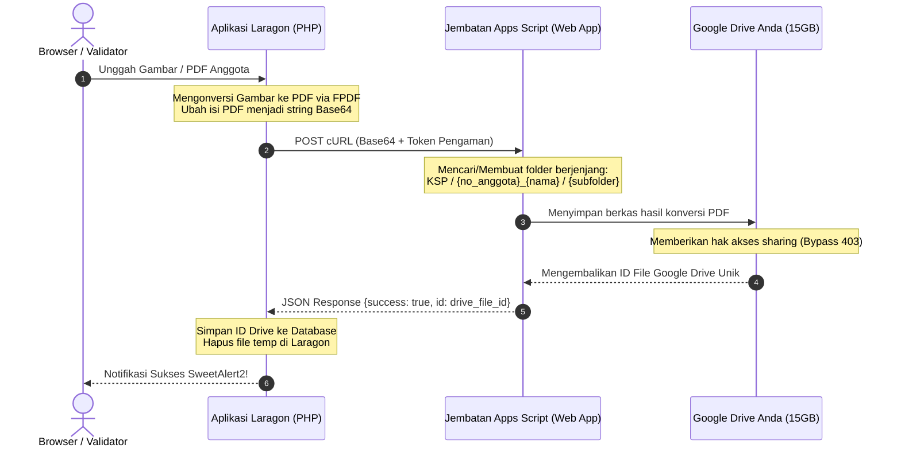

# 🧭 Panduan Cepat & Rapi: Integrasi Google Drive KSP Harapan Mulya
## (Metode Google Apps Script Web App — Bypass Kuota 0 Byte)

Panduan ini disusun secara sistematis dan mudah dipahami agar Anda atau tim pengembang dapat melakukan pemasangan (*setup*) integrasi penyimpanan Google Drive dari **nol (0)** hingga berjalan penuh dalam waktu kurang dari **10 menit**.

---

## 🏗️ 1. Mengapa Kita Menggunakan Metode Ini?

* **Masalah Akun Robot (Service Account):** Akun Service Account Google modern membatasi kuota penyimpanan gratis menjadi **0 byte**, sehingga langsung memicu error `storageQuotaExceeded`.
* **Solusi Jembatan Apps Script:** Kita menggunakan **Google Apps Script** sebagai jembatan API. Skrip ini bertindak atas nama akun Gmail pribadi Anda (`koperasiharapanmulyaunp@gmail.com`) sehingga proses unggah file akan menggunakan kuota gratis **15 GB** dari Drive pribadi Anda sendiri!



---

## ⚡ 2. LANGKAH 1: Setup di Google Apps Script (Hanya 5 Menit!)

Ikuti langkah-langkah di bawah ini secara berurutan. Pastikan Anda berada dalam **Mode Penyamaran (Incognito Window)** di browser Anda!

### 1️⃣ Buka Google Apps Script
1. Buka browser dan pilih **New Incognito Window** (Mode Penyamaran).
2. Login ke akun Gmail Koperasi Anda: **`koperasiharapanmulyaunp@gmail.com`**.
3. Buka alamat berikut: **[script.google.com](https://script.google.com/)**.
4. Klik tombol **New Project** di pojok kiri atas.
5. Ubah nama proyek dengan mengklik *"Untitled project"* di pojok kiri atas, ketik **`Jembatan Google Drive KSP`**, lalu klik **Rename**.

---

### 2️⃣ Tempelkan Kode Jembatan
Hapus seluruh kode bawaan yang ada di editor, lalu salin dan tempelkan kode di bawah ini secara utuh:

```javascript
// Token Pengaman - Wajib sama dengan yang ada di google-apps-script-config.json
var API_KEY = "ksp_harapan_mulya_secure_token";

function doPost(e) {
  var result = {};
  try {
    // 1. Validasi Keamanan Token
    var clientKey = e.parameter.key;
    if (clientKey !== API_KEY) {
      throw new Error("Akses Ditolak: Token Pengaman Tidak Valid.");
    }

    var action = e.parameter.action;
    
    // AKSI A: Pengecekan atau Pembuatan Folder Berjenjang
    if (action === 'getOrCreateFolder') {
      var folderName = e.parameter.folderName;
      var parentFolderId = e.parameter.parentFolderId;
      
      var parentFolder;
      if (parentFolderId) {
        parentFolder = DriveApp.getFolderById(parentFolderId);
      } else {
        parentFolder = DriveApp.getRootFolder();
      }
      
      var folders = parentFolder.getFoldersByName(folderName);
      if (folders.hasNext()) {
        result.id = folders.next().getId();
      } else {
        var folder = parentFolder.createFolder(folderName);
        result.id = folder.getId();
      }
      result.success = true;
      
    // AKSI B: Unggah file PDF dari String Base64
    } else if (action === 'uploadFile') {
      var fileName = e.parameter.fileName;
      var parentFolderId = e.parameter.parentFolderId;
      var mimeType = e.parameter.mimeType || 'application/pdf';
      var base64Data = e.parameter.data;
      
      var decoded = Utilities.base64Decode(base64Data);
      var blob = Utilities.newBlob(decoded, mimeType, fileName);
      
      var parentFolder = DriveApp.getFolderById(parentFolderId);
      var file = parentFolder.createFile(blob);
      
      // Mencegah Error 403 Forbidden Download akibat bug Multi-Account Google
      file.setSharing(DriveApp.Access.ANYONE_WITH_LINK, DriveApp.Permission.VIEW);
      
      result.id = file.getId();
      result.success = true;
      
    // AKSI C: Hapus File (Pindahkan ke Trash/Sampah)
    } else if (action === 'deleteFile') {
      var driveFileId = e.parameter.driveFileId;
      var file = DriveApp.getFileById(driveFileId);
      file.setTrashed(true);
      result.success = true;
      
    } else {
      throw new Error('Aksi tidak dikenal: ' + action);
    }
    
  } catch (err) {
    result.success = false;
    result.error = err.toString();
  }
  
  return ContentService.createTextOutput(JSON.stringify(result))
    .setMimeType(ContentService.MimeType.JSON);
}
```

> [!TIP]
> Tekan tombol **Save** (ikon disket) atau `Ctrl + S` pada keyboard untuk menyimpan kode Anda.

---

### 3️⃣ Terapkan (Deploy) Sebagai Web App
1. Klik tombol **Deploy** di kanan atas, lalu pilih **New deployment**.
2. Klik ikon **Gir Pengaturan (Select type)** di samping tulisan *Select type*, lalu pilih **Web app**.
3. Lengkapi konfigurasi sebagai berikut:
   * **Description:** `Versi 1 - Integrasi Google Drive KSP`
   * **Execute as:** Pilih **Me (koperasiharapanmulyaunp@gmail.com)**
   * **Who has access:** Pilih **Anyone** (Langkah ini wajib agar server Laragon PHP Anda dapat melakukan koneksi cURL tanpa memerlukan login manual).
4. Klik tombol **Deploy** di bagian bawah.

---

### 4️⃣ Berikan Otorisasi Keamanan Akun Google
Karena skrip ini akan mengakses file dan folder di Google Drive Anda, Google mewajibkan otorisasi keamanan sekali saja:
1. Ketika muncul pop-up *"Authorization Required"*, klik **Authorize Access**.
2. Klik nama akun Gmail Anda (`koperasiharapanmulyaunp@gmail.com`).
3. Pada halaman *"Google hasn't verified this app"*, klik tautan **Advanced** (Lanjutan) di kiri bawah.
4. Klik tautan **Go to Jembatan Google Drive KSP (unsafe)** di bagian paling bawah.
5. Pada halaman persetujuan akses Google Drive, klik tombol **Allow** (Izinkan).

---

### 5️⃣ Salin URL Web App
1. Setelah proses deploy selesai, kotak dialog akan menampilkan **Web app URL** yang berakhiran dengan `/exec`.
2. Klik tombol **Copy** di samping URL tersebut.
3. Simpan URL ini sementara di notepad Anda.

---

## ⚙️ 3. LANGKAH 2: Setup di Aplikasi Koperasi (Laragon)

Sekarang kita akan menghubungkan URL Web App Google Apps Script ke kode backend koperasi Anda.

### 1️⃣ Buat Berkas Konfigurasi
Buka folder Laragon Anda dan buat berkas baru dengan spesifikasi berikut:
* **Lokasi Path:** `c:\laragon\www\Ksp_Koperasinat\storage\app\google-apps-script-config.json`
* **Isi Konten Berkas:** (Tempelkan URL Web App yang telah Anda salin tadi pada kolom `"web_app_url"`)

```json
{
    "web_app_url": "TEMPELKAN_URL_WEB_APP_APPS_SCRIPT_ANDA_DISINI",
    "api_key": "ksp_harapan_mulya_secure_token"
}
```

> [!WARNING]
> Pastikan token `"api_key"` di atas sama persis dengan variabel `API_KEY` yang Anda tulis di Google Apps Script pada **Langkah 1 Poin 2** (bawaan: `ksp_harapan_mulya_secure_token`). Berkas ini secara otomatis diabaikan oleh Git (`.gitignore`) agar token keamanan Anda tidak bocor ke publik.

---

## 🧪 4. LANGKAH 3: Uji Coba Integrasi

Setelah kedua langkah di atas selesai, sistem siap diuji coba secara langsung:

1. **Unggah Dokumen:**
   * Buka aplikasi Koperasi Anda di browser.
   * Masuk ke menu **Manajemen Anggota** -> pilih salah satu anggota -> klik **Edit Anggota**.
   * Di sebelah kanan pada panel **Dokumen Kelengkapan**, unggah file KTP atau Kartu Keluarga (bisa gambar `.png`/`.jpg` maupun dokumen `.pdf`).
   * Tekan tombol **Simpan**.
2. **Validasi Berhasil:**
   * SweetAlert2 akan memunculkan pop-up sukses berwarna hijau.
   * Buka direktori lokal Laragon Anda di `public/uploads/temp/` dan pastikan direktori tersebut **tetap kosong** (karena berkas sementara langsung dihapus otomatis setelah sukses diunggah ke cloud).
3. **Periksa Google Drive Pribadi:**
   * Masuk ke Google Drive pribadi Anda.
   * Pastikan folder bernama **`KSP`** telah dibuat secara otomatis di root Drive Anda.
   * Di dalam folder `KSP`, pastikan struktur folder tertata rapi sebagai berikut:
     ```
     Drive Saya
     └── KSP
         └── {no_anggota}_{nama_anggota}   (Contoh: A001_Ahmad_Rizki)
             └── profil
                 └── ktp_A001_Ahmad_Rizki.pdf
     ```
4. **Pratinjau Dokumen:**
   * Klik tombol **Buka** pada file dokumen anggota di aplikasi koperasi.
   * Pastikan berkas PDF terbuka dengan penampil bawaan (*iframe viewer*) secara instan, lengkap dengan tombol unduh langsung yang aman dan tanpa hambatan.

---

## 💡 5. Tips Pemeliharaan & Troubleshooting

### 🔄 Bagaimana Cara Mengubah/Memperbarui Kode Apps Script?
Jika di masa mendatang Anda melakukan perubahan kode pada editor Google Apps Script, ikuti langkah berikut agar perubahan tersebut aktif:
1. Setelah mengedit kode, simpan perubahan dengan menekan tombol **Save** (`Ctrl + S`).
2. Klik tombol **Deploy** -> pilih **Manage deployments**.
3. Klik ikon **Pensil (Edit)** di kanan atas.
4. Pada dropdown **Version**, pilih **New version** (Wajib membuat versi baru agar Google memperbarui endpoint Web App Anda).
5. Klik tombol **Deploy**.

### 🔒 Mengapa Saya Mendapatkan Error 403 saat Unduh Berkas?
* **Penyebab:** Google memiliki kendala bawaan (*bug*) jika pengguna login ke beberapa akun Gmail sekaligus dalam satu browser.
* **Solusi Otomatis:** Kode Apps Script di atas telah dilengkapi baris `file.setSharing(DriveApp.Access.ANYONE_WITH_LINK, DriveApp.Permission.VIEW)`. Kode ini secara otomatis mengatur hak akses berkas menjadi *"Anyone with link (Viewer)"* setiap kali berkas diunggah, sehingga tombol pratinjau dan unduh langsung di aplikasi koperasi Anda akan bekerja lancar 100% tanpa error otorisasi Gmail!

---

> [!NOTE]
> Sistem ini juga dilengkapi dengan **Robust Offline Local Fallback**. Jika server Google Apps Script mengalami kendala jaringan, berkas unggahan koperasi akan secara otomatis disimpan di server lokal hosting Laragon Anda (`public/uploads/dokumen/`) agar operasional koperasi tetap berjalan tanpa hambatan sedetik pun.
