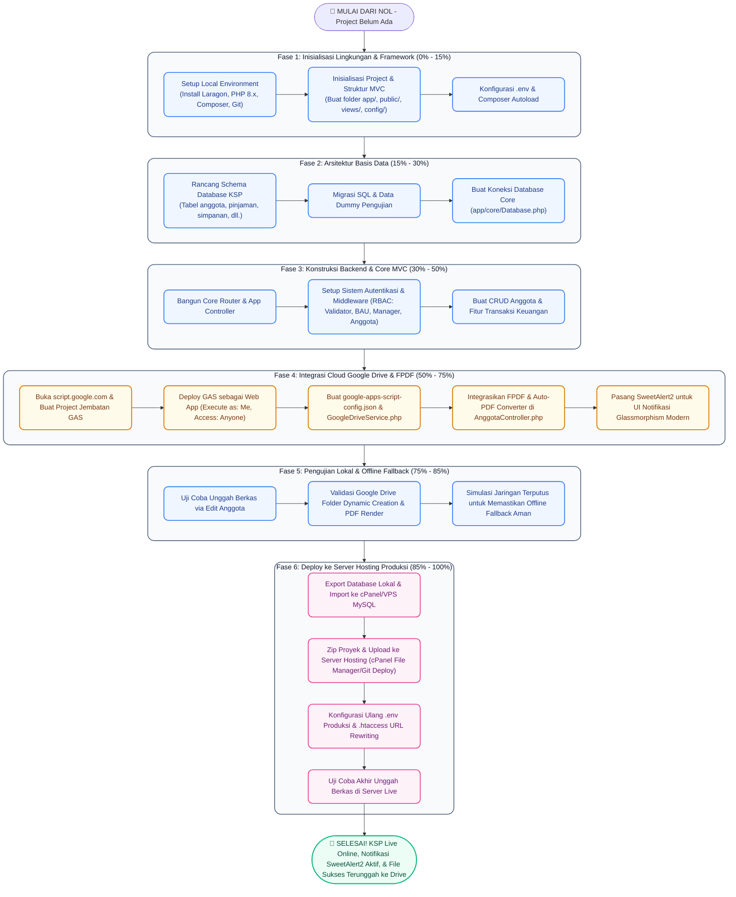

# 🧭 Master Blueprint: Pembangunan KSP Harapan Mulya dari Nol (0) Hingga Upload Produksi
*(Panduan Komprehensif Siklus Hidup Proyek & Integrasi Google Drive)*

Selamat datang di panduan terlengkap dan sistematis untuk membangun **Sistem Informasi Manajemen Koperasi Simpan Pinjam (KSP) Harapan Mulya**. Panduan ini dirancang khusus untuk membimbing Anda dari **detik pertama** (ketika file kode proyek belum ada sama sekali di komputer Anda) hingga aplikasi selesai dibangun, diunggah ke server hosting produksi (cPanel/VPS), dan fitur penyimpanan cloud Google Drive berfungsi sempurna.

---

## 📊 1. Peta Jalan Pengembangan (End-to-End Roadmap)

Berikut adalah diagram alur visual komprehensif yang memetakan seluruh tahapan pengembangan dari kondisi **nol (belum ada proyek)** hingga sistem **selesai dan berhasil online serta dapat mengunggah berkas**:



---

## 🏗️ FASE 1: Inisialisasi Lingkungan & Framework (0% - 15%)

Langkah pertama dimulai dari komputer kosong yang belum memiliki file proyek.

### 1️⃣ Siapkan Lingkungan Kerja (Local Environment)
1. Unduh dan pasang **Laragon** (sangat direkomendasikan untuk Windows) atau **XAMPP**.
2. Pastikan PHP yang aktif adalah versi **PHP 8.x** ke atas.
3. Install **Composer** (alat pengelola paket PHP) secara global di komputer Anda.
4. Buka terminal (CMD / PowerShell) dan pastikan instalasi berhasil:
   ```bash
   php -v
   composer -v
   ```

### 2️⃣ Inisialisasi Struktur Folder MVC
Buka direktori root server lokal Anda (misal `C:\laragon\www\`) dan buat folder proyek baru dengan nama `Ksp_Koperasinat`. Masuk ke dalam folder tersebut dan susun struktur folder MVC murni sebagai berikut:
```
Ksp_Koperasinat/
├── app/
│   ├── config/         # File konfigurasi sistem
│   ├── controllers/    # Controller pengontrol alur data
│   ├── core/           # Core library (App, Controller, Database, View, Auth)
│   ├── helpers/        # Helper pendukung (format rupiah, dll.)
│   ├── middleware/     # Proteksi rute (AuthMiddleware)
│   ├── models/         # Pengolah data database (MySQL)
│   └── services/       # Layanan eksternal (Google Drive Service)
├── database/           # Script migrasi basis data SQL
├── public/             # Entry point utama & folder aset publik
│   ├── css/            # Aset CSS
│   ├── js/             # Aset JavaScript
│   ├── uploads/        # Folder upload berkas (temp & offline local fallback)
│   │   ├── temp/
│   │   └── dokumen/
│   └── index.php       # Entry point utama (Front Controller)
├── storage/            # Penyimpanan log dan file config internal
│   └── app/
├── views/              # Berkas UI / Tampilan HTML & PHP
│   ├── auth/           # UI Login & Ganti Sandi
│   ├── layout/         # UI Header, Footer, Sidebar (main.php)
│   └── anggota/        # UI Manajemen Anggota
├── .env                # Variabel lingkungan rahasia (DB, URL)
├── .env.example        # Template konfigurasi .env
├── .gitignore          # Daftar file yang diabaikan Git
└── composer.json       # File manajemen library pihak ketiga
```

### 3️⃣ Konfigurasi Composer Autoload & `.env`
1. Buat berkas `composer.json` di root proyek untuk mempermudah pemanggilan kelas otomatis (PSR-4 Autoloading) dan pasang library **FPDF** (opsional untuk konversi PDF):
   ```json
   {
       "autoload": {
           "psr-4": {
               "App\\": "app/"
           }
       },
       "require": {
           "fpdf/fpdf": "^1.86"
       }
   }
   ```
2. Jalankan perintah berikut di terminal proyek untuk mengunduh library dan membuat berkas autoload:
   ```bash
   composer install
   ```
3. Buat berkas `.env` untuk menyimpan detail database lokal Anda:
   ```env
   APP_NAME="KSP Harapan Mulya"
   APP_URL="http://localhost/Ksp_Koperasinat/public"
   APP_ENV="local"

   DB_HOST="localhost"
   DB_PORT="3306"
   DB_NAME="ksp_koperasinat"
   DB_USER="root"
   DB_PASS=""
   ```

---

## 🗄️ FASE 2: Arsitektur Basis Data (15% - 30%)

Koperasi membutuhkan database terstruktur untuk mencatat identitas anggota dan status berkas dokumen mereka.

### 1️⃣ Rancang & Migrasi Schema Database
1. Aktifkan MySQL di Laragon/XAMPP, buka **phpMyAdmin** atau HeidiSQL, lalu buat database baru dengan nama `ksp_koperasinat`.
2. Buat berkas `database/migrate_anggota_dokumen.sql` dan eksekusi perintah DDL berikut untuk membangun relasi tabel anggota dan dokumen secara aman:
   ```sql
   -- 1. Tabel Utama Anggota
   CREATE TABLE IF NOT EXISTS anggota (
       id INT AUTO_INCREMENT PRIMARY KEY,
       no_anggota VARCHAR(20) UNIQUE NOT NULL,
       nama VARCHAR(100) NOT NULL,
       alamat TEXT NULL,
       telepon VARCHAR(20) NULL,
       status_aktif TINYINT(1) DEFAULT 1,
       created_at TIMESTAMP DEFAULT CURRENT_TIMESTAMP
   ) ENGINE=InnoDB DEFAULT CHARSET=utf8mb4;

   -- 2. Tabel Dokumen (Terintegrasi Drive & Fallback)
   CREATE TABLE IF NOT EXISTS anggota_dokumen (
       id INT AUTO_INCREMENT PRIMARY KEY,
       anggota_id INT NOT NULL,
       jenis_dokumen VARCHAR(50) NOT NULL, -- 'ktp', 'kk', 'pengajuan', 'perjanjian'
       nama_file VARCHAR(255) NOT NULL,
       drive_file_id VARCHAR(255) NULL, -- Menyimpan ID Google Drive (NULL jika offline fallback)
       created_at TIMESTAMP DEFAULT CURRENT_TIMESTAMP,
       updated_at TIMESTAMP DEFAULT CURRENT_TIMESTAMP ON UPDATE CURRENT_TIMESTAMP,
       FOREIGN KEY (anggota_id) REFERENCES anggota(id) ON DELETE CASCADE
   ) ENGINE=InnoDB DEFAULT CHARSET=utf8mb4;
   ```

### 2️⃣ Buat Koneksi Database Core
Tulis koneksi terpusat menggunakan PDO agar aman dari SQL Injection. Buat berkas `app/core/Database.php`:
```php
<?php
namespace App\Core;

use PDO;
use PDOException;

class Database {
    private static $instance = null;
    private $conn;

    private function __construct() {
        // Load variabel .env secara manual jika tidak menggunakan framework
        $host = $_ENV['DB_HOST'] ?? 'localhost';
        $db   = $_ENV['DB_NAME'] ?? 'ksp_koperasinat';
        $user = $_ENV['DB_USER'] ?? 'root';
        $pass = $_ENV['DB_PASS'] ?? '';

        try {
            $this->conn = new PDO("mysql:host=$host;dbname=$db;charset=utf8mb4", $user, $pass);
            $this->conn->setAttribute(PDO::ATTR_ERRMODE, PDO::ERRMODE_EXCEPTION);
            $this->conn->setAttribute(PDO::ATTR_DEFAULT_FETCH_MODE, PDO::FETCH_OBJ);
        } catch (PDOException $e) {
            die("Koneksi Database Gagal: " . $e->getMessage());
        }
    }

    public static function getInstance() {
        if (!self::$instance) {
            self::$instance = new self();
        }
        return self::$instance;
    }

    public function getConnection() {
        return $this->conn;
    }
}
```

---

## 💻 FASE 3: Konstruksi Backend & Core MVC (30% - 50%)

Membangun fondasi router dan siklus request-response tanpa framework eksternal.

### 1️⃣ Front Controller (`public/index.php`)
Setiap request akan diarahkan ke berkas utama ini terlebih dahulu menggunakan aturan `.htaccess` rewriting:
```php
<?php
require_once __DIR__ . '/../vendor/autoload.php';

// Simple .env Loader
if (file_exists(__DIR__ . '/../.env')) {
    $lines = file(__DIR__ . '/../.env', FILE_IGNORE_NEW_LINES | FILE_SKIP_EMPTY_LINES);
    foreach ($lines as $line) {
        if (strpos(trim($line), '#') === 0) continue;
        list($name, $value) = explode('=', $line, 2);
        $_ENV[trim($name)] = trim($value, '"\' ');
    }
}

// Inisialisasi Session
if (session_status() == PHP_SESSION_NONE) {
    session_start();
}

// Panggil Router Utama
$app = new App\Core\App();
```

### 2️⃣ Pengatur Rute Core (`app/core/App.php`)
Kelas ini berfungsi memetakan URL ke Controller dan Action yang sesuai (contoh: `domain.com/anggota/edit/1`):
```php
<?php
namespace App\Core;

class App {
    protected $controller = 'HomeController';
    protected $method = 'index';
    protected $params = [];

    public function __construct() {
        $url = $this->parseUrl();

        if (file_exists(__DIR__ . '/../controllers/' . ucfirst($url[0] ?? '') . 'Controller.php')) {
            $this->controller = ucfirst($url[0]) . 'Controller';
            unset($url[0]);
        }

        $controllerClass = "\\App\\Controllers\\" . $this->controller;
        if (class_exists($controllerClass)) {
            $this->controller = new $controllerClass;
        } else {
            die("Controller $controllerClass Tidak Ditemukan.");
        }

        if (isset($url[1])) {
            if (method_exists($this->controller, $url[1])) {
                $this->method = $url[1];
                unset($url[1]);
            }
        }

        $this->params = $url ? array_values($url) : [];
        call_user_func_array([$this->controller, $this->method], $this->params);
    }

    private function parseUrl() {
        if (isset($_GET['url'])) {
            return explode('/', filter_var(rtrim($_GET['url'], '/'), FILTER_SANITIZE_URL));
        }
        return [];
    }
}
```

---

## ☁️ FASE 4: Integrasi Cloud Google Drive & FPDF (50% - 75%)

Fase krusial untuk mengatasi limitasi kuota 0 byte Service Account dengan jembatan Apps Script.

### 1️⃣ Setup Google Apps Script Web App (Di Cloud Google)
Pastikan Anda menggunakan **Mode Penyamaran (Incognito)** agar tidak terjadi bentrokan otentikasi multi-akun:
1. Buka dan login ke Gmail koperasi: **`koperasiharapanmulyaunp@gmail.com`**.
2. Masuk ke **[script.google.com](https://script.google.com/)** -> Klik **New Project** di pojok kiri atas.
3. Beri nama proyek: `Jembatan Google Drive KSP`.
4. Hapus isi editor script bawaan, lalu tempel kode jembatan handal berikut:
   ```javascript
   var API_KEY = "ksp_harapan_mulya_secure_token"; // Token Pengaman Rahasia Anda

   function doPost(e) {
     var result = {};
     try {
       // 1. Validasi Token Keamanan
       var clientKey = e.parameter.key;
       if (clientKey !== API_KEY) {
         throw new Error("Akses Ditolak: Token Pengaman Tidak Valid.");
       }

       var action = e.parameter.action;
     
       // AKSI A: Buat Folder Dinamis Berjenjang
       if (action === 'getOrCreateFolder') {
         var folderName = e.parameter.folderName;
         var parentFolderId = e.parameter.parentFolderId;
       
         var parentFolder = parentFolderId ? DriveApp.getFolderById(parentFolderId) : DriveApp.getRootFolder();
         var folders = parentFolder.getFoldersByName(folderName);
         
         if (folders.hasNext()) {
           result.id = folders.next().getId();
         } else {
           result.id = parentFolder.createFolder(folderName).getId();
         }
         result.success = true;
       
       // AKSI B: Unggah File PDF dari data Base64
       } else if (action === 'uploadFile') {
         var fileName = e.parameter.fileName;
         var parentFolderId = e.parameter.parentFolderId;
         var mimeType = e.parameter.mimeType || 'application/pdf';
         var base64Data = e.parameter.data;
       
         var decoded = Utilities.base64Decode(base64Data);
         var blob = Utilities.newBlob(decoded, mimeType, fileName);
       
         var parentFolder = DriveApp.getFolderById(parentFolderId);
         var file = parentFolder.createFile(blob);
       
         // Bypass Error 403 Forbidden Download akibat bug Multi-Account Google
         file.setSharing(DriveApp.Access.ANYONE_WITH_LINK, DriveApp.Permission.VIEW);
       
         result.id = file.getId();
         result.success = true;
       
       // AKSI C: Hapus File di Drive (Pindahkan ke Sampah)
       } else if (action === 'deleteFile') {
         var driveFileId = e.parameter.driveFileId;
         DriveApp.getFileById(driveFileId).setTrashed(true);
         result.success = true;
       } else {
         throw new Error('Aksi tidak dikenal: ' + action);
       }
     } catch (err) {
       result.success = false;
       result.error = err.toString();
     }
     return ContentService.createTextOutput(JSON.stringify(result)).setMimeType(ContentService.MimeType.JSON);
   }
   ```
5. Klik **Save** (ikon disket) atau `Ctrl + S`.
6. Klik tombol **Deploy** -> pilih **New deployment**.
7. Klik ikon **Gir (Select type)** -> pilih **Web app**.
8. Konfigurasi:
   * **Execute as:** `Me (koperasiharapanmulyaunp@gmail.com)`
   * **Who has access:** `Anyone` (Supaya server Laragon PHP dapat menembus API tanpa login).
9. Klik **Deploy** -> klik **Authorize Access** -> masuk ke Gmail Anda -> klik **Advanced** -> klik **Go to Jembatan Google Drive KSP (unsafe)** -> klik **Allow**.
10. Salin **Web app URL** yang muncul (berakhiran `/exec`).

### 2️⃣ Hubungkan Kode PHP Aplikasi dengan Apps Script
1. Buat berkas rahasia di Laragon pada path: `storage/app/google-apps-script-config.json`
   ```json
   {
       "web_app_url": "TEMPELKAN_URL_WEB_APP_APPS_SCRIPT_ANDA_DISINI",
       "api_key": "ksp_harapan_mulya_secure_token"
   }
   ```
2. Buat driver PHP cURL `app/services/GoogleDriveService.php` sebagai penghubung data:
   ```php
   <?php
   namespace App\Services;

   use Exception;

   class GoogleDriveService {
       private $webAppUrl;
       private $apiKey;

       public function __construct() {
           $configPath = __DIR__ . '/../../storage/app/google-apps-script-config.json';
           if (!file_exists($configPath)) {
               throw new Exception("Berkas konfigurasi Apps Script tidak ditemukan!");
           }
           $config = json_decode(file_get_contents($configPath), true);
           $this->webAppUrl = $config['web_app_url'];
           $this->apiKey = $config['api_key'];
       }

       public function getOrCreateFolder($folderName, $parentFolderId = null) {
           $response = $this->sendRequest([
               'action' => 'getOrCreateFolder',
               'folderName' => $folderName,
               'parentFolderId' => $parentFolderId
           ]);
           if (!$response['success']) {
               throw new Exception("Gagal Folder: " . ($response['error'] ?? 'Unknown Error'));
           }
           return $response['id'];
       }

       public function uploadFile($localFilePath, $fileName, $parentFolderId) {
           $base64Data = base64_encode(file_get_contents($localFilePath));
           $response = $this->sendRequest([
               'action' => 'uploadFile',
               'fileName' => $fileName,
               'parentFolderId' => $parentFolderId,
               'mimeType' => 'application/pdf',
               'data' => $base64Data
           ]);
           if (!$response['success']) {
               throw new Exception("Gagal Unggah Drive: " . ($response['error'] ?? 'Unknown Error'));
           }
           return $response['id'];
       }

       public function deleteFile($driveFileId) {
           if (empty($driveFileId)) return false;
           $response = $this->sendRequest([
               'action' => 'deleteFile',
               'driveFileId' => $driveFileId
           ]);
           return $response['success'] ?? false;
       }

       private function sendRequest($params) {
           $params['key'] = $this->apiKey;
           $ch = curl_init();
           curl_setopt($ch, CURLOPT_URL, $this->webAppUrl);
           curl_setopt($ch, CURLOPT_POST, true);
           curl_setopt($ch, CURLOPT_POSTFIELDS, http_build_query($params));
           curl_setopt($ch, CURLOPT_RETURNTRANSFER, true);
           curl_setopt($ch, CURLOPT_FOLLOWLOCATION, true); // Wajib mengikuti redirect 302 Google
           curl_setopt($ch, CURLOPT_TIMEOUT, 60);

           $response = curl_exec($ch);
           curl_close($ch);
           return json_decode($response, true);
       }
   }
   ```

### 3️⃣ FPDF & Logika Auto-PDF Converter di Controller
Di dalam `app/controllers/AnggotaController.php`, buat aksi saat Admin mengunggah gambar (.jpg/.png) atau PDF asli. Gambar tersebut otomatis dibungkus rapi ke dalam dokumen PDF A4 sebelum dikirim ke Google Drive:
```php
<?php
namespace App\Controllers;

use App\Core\Controller;
use App\Core\Database;
use App\Services\GoogleDriveService;
use FPDF;
use Exception;

class AnggotaController extends Controller {
    private $db;
    private $driveService;

    public function __construct() {
        $this->db = Database::getInstance()->getConnection();
        $this->driveService = new GoogleDriveService();
    }

    public function uploadDokumen($anggotaId, $jenisDokumen, $fileInputName) {
        if (!isset($_FILES[$fileInputName]) || $_FILES[$fileInputName]['error'] !== UPLOAD_ERR_OK) {
            return false;
        }

        $anggota = $this->getAnggotaById($anggotaId);
        $tmpName = $_FILES[$fileInputName]['tmp_name'];
        $origName = $_FILES[$fileInputName]['name'];
        $ext = strtolower(pathinfo($origName, PATHINFO_EXTENSION));

        // 1. Buat folder penampung sementara di server lokal Laragon
        $tempDir = ROOT_PATH . '/public/uploads/temp/';
        if (!file_exists($tempDir)) mkdir($tempDir, 0777, true);
        
        $tempOutName = $jenisDokumen . '_' . $anggota->no_anggota . '_' . time();
        $pdfTempPath = $tempDir . $tempOutName . '.pdf';

        // 2. Konversi Gambar Ke PDF via FPDF atau Simpan Langsung jika sudah PDF
        if ($ext === 'pdf') {
            move_uploaded_file($tmpName, $pdfTempPath);
        } else if (in_array($ext, ['jpg', 'jpeg', 'png'])) {
            $pdf = new FPDF('P', 'mm', 'A4');
            $pdf->AddPage();
            
            // Atur gambar agar berada di tengah halaman A4 dengan proporsional
            $imageType = ($ext === 'png') ? 'PNG' : 'JPEG';
            $pdf->Image($tmpName, 10, 30, 190, 0, $imageType);
            $pdf->Output('F', $pdfTempPath);
        } else {
            throw new Exception("Format berkas tidak diizinkan.");
        }

        // 3. Cari/Buat Folder Dinamis di Google Drive
        $parentFolderId = null; 
        try {
            $kspFolderId = $this->driveService->getOrCreateFolder('KSP');
            $anggotaFolderName = $anggota->no_anggota . '_' . str_replace(' ', '_', $anggota->nama);
            $anggotaFolderId = $this->driveService->getOrCreateFolder($anggotaFolderName, $kspFolderId);
            
            $subFolder = ($jenisDokumen === 'ktp' || $jenisDokumen === 'kk') ? 'profil' : 'pinjaman';
            $targetFolderId = $this->driveService->getOrCreateFolder($subFolder, $anggotaFolderId);

            // 4. Hapus Berkas Lama di Google Drive & Database untuk mencegah penumpukan sampah
            $this->hapusBerkasLama($anggotaId, $jenisDokumen);

            // 5. Unggah Berkas Baru ke Cloud
            $fileNameCloud = $jenisDokumen . '_' . $anggotaFolderName . '.pdf';
            $driveFileId = $this->driveService->uploadFile($pdfTempPath, $fileNameCloud, $targetFolderId);

            // Hapus file sampah sementara di server lokal Laragon untuk hemat space
            if (file_exists($pdfTempPath)) unlink($pdfTempPath);

        } catch (Exception $e) {
            // ==========================================
            // ROBUST OFFLINE LOCAL FALLBACK
            // Jika koneksi Google API down, berkas diselamatkan secara lokal permanen!
            // ==========================================
            $localDir = ROOT_PATH . '/public/uploads/dokumen/';
            if (!file_exists($localDir)) mkdir($localDir, 0777, true);
            
            $fileNameCloud = $tempOutName . '.pdf';
            rename($pdfTempPath, $localDir . $fileNameCloud);
            $driveFileId = null; // Ditulis NULL di database agar tahu berkas berstatus Offline
        }

        // 6. Simpan Status Berkas ke Database MySQL Koperasi
        $stmt = $this->db->prepare("INSERT INTO anggota_dokumen (anggota_id, jenis_dokumen, nama_file, drive_file_id) VALUES (?, ?, ?, ?)");
        $stmt->execute([$anggotaId, $jenisDokumen, $fileNameCloud, $driveFileId]);
        return true;
    }

    private function hapusBerkasLama($anggotaId, $jenisDokumen) {
        $stmt = $this->db->prepare("SELECT id, nama_file, drive_file_id FROM anggota_dokumen WHERE anggota_id = ? AND jenis_dokumen = ?");
        $stmt->execute([$anggotaId, $jenisDokumen]);
        $oldDoc = $stmt->fetch();

        if ($oldDoc) {
            // Hapus file fisik di Drive
            if (!empty($oldDoc->drive_file_id)) {
                $this->driveService->deleteFile($oldDoc->drive_file_id);
            } else {
                // Hapus file fisik lokal jika merupakan offline fallback
                $localPath = ROOT_PATH . '/public/uploads/dokumen/' . $oldDoc->nama_file;
                if (file_exists($localPath)) unlink($localPath);
            }
            // Hapus record di basis data
            $delStmt = $this->db->prepare("DELETE FROM anggota_dokumen WHERE id = ?");
            $delStmt->execute([$oldDoc->id]);
        }
    }

    private function getAnggotaById($id) {
        $stmt = $this->db->prepare("SELECT * FROM anggota WHERE id = ?");
        $stmt->execute([$id]);
        return $stmt->fetch();
    }
}
```

### 4️⃣ Tampilan Penampil Dokumen (`views/anggota/view_dokumen.php`)
Secara dinamis mendeteksi apakah berkas berstatus cloud atau offline, lalu merender pratinjau yang sesuai:
```php
<?php
// Deteksi File ID dari Query String
$driveFileId = $dokumen->drive_file_id;
$fileName = $dokumen->nama_file;

if (!empty($driveFileId)): 
    // MODE CLOUD: Tampilkan Google Drive Embedded Viewer (Secure & Fast)
    $viewUrl = "https://drive.google.com/file/d/" . $driveFileId . "/preview";
    $downloadUrl = "https://drive.google.com/uc?export=download&id=" . $driveFileId;
?>
    <div class="iframe-container" style="position: relative; width: 100%; height: 600px;">
        <iframe src="<?= $viewUrl ?>" width="100%" height="100%" style="border: none; border-radius: 8px;"></iframe>
    </div>
    <div class="mt-3 text-center">
        <a href="<?= $downloadUrl ?>" target="_blank" class="btn btn-primary-premium">
            <i class="bi bi-cloud-arrow-down-fill"></i> Unduh Dokumen Asli dari Cloud
        </a>
    </div>
<?php else: 
    // MODE LOCAL OFFLINE FALLBACK: Tampilkan PDF Penampil Lokal
    $localUrl = APP_URL . "/uploads/dokumen/" . $fileName;
?>
    <div class="alert alert-warning-premium text-center">
        <i class="bi bi-wifi-off"></i> Koneksi Cloud Google Drive Terputus. Menampilkan berkas cadangan lokal dari hosting.
    </div>
    <iframe src="<?= $localUrl ?>" width="100%" height="600px" style="border: none; border-radius: 8px;"></iframe>
<?php endif; ?>
```

---

## 🧪 FASE 5: Pengujian Lokal & Offline Fallback (75% - 85%)

Sebelum mengunggah sistem ke server hosting publik, lakukan serangkaian uji coba penting di server Laragon lokal Anda:

### 1️⃣ Uji Pengunggahan & Pembuatan Folder Otomatis
* Buka halaman edit profil anggota di browser localhost.
* Unggah foto KTP berformat `.jpg` lalu klik **Simpan**.
* Pastikan SweetAlert2 berkedip hijau menandakan proses unggah sukses.
* Periksa folder Google Drive Gmail koperasi Anda. Anda harus menemukan struktur folder `KSP` -> `A001_Nama_Anggota` -> `profil` -> `ktp_A001_Nama_Anggota.pdf` terbuat otomatis tanpa intervensi manual!

### 2️⃣ Uji Ketahanan Offline Fallback (Simulasi Gangguan Jaringan)
1. Buka kembali berkas konfigurasi rahasia `storage/app/google-apps-script-config.json`.
2. Rusak sengaja URL Web App di dalamnya (misal mengubah huruf `/exec` menjadi `/error`).
3. Lakukan pengunggahan dokumen sekali lagi.
4. **Hasil yang diharapkan:** Proses pengunggahan tidak boleh macet atau memunculkan error PHP! Aplikasi harus tetap memunculkan SweetAlert2 sukses, dan berkas tersimpan aman di server lokal Laragon Anda pada direktori `public/uploads/dokumen/` serta nilai `drive_file_id` di database tersimpan sebagai `NULL`.

---

## 🚀 FASE 6: Deploy ke Server Hosting Produksi (85% - 100%)

Fase akhir untuk melempar aplikasi Koperasi dari localhost Laragon ke server internet agar dapat diakses oleh BAU, Manager, dan Anggota dari mana saja secara real-time.

### 1️⃣ Backup & Migrasi Basis Data Lokal ke cPanel Hosting
1. Masuk ke phpMyAdmin lokal (`http://localhost/phpmyadmin`).
2. Pilih database `ksp_koperasinat` -> Klik tab **Export** -> Klik **Go** (Simpan file `.sql` di komputer Anda).
3. Buka cPanel server hosting Anda -> Cari menu **MySQL Database Wizard**.
4. Buat database baru (misal: `useripx_ksp`) -> Buat user database baru dan buat password yang kuat.
5. Hubungkan user tersebut ke database dengan hak akses **ALL PRIVILEGES**.
6. Kembali ke Dashboard cPanel -> Cari dan klik **phpMyAdmin**.
7. Pilih database baru Anda (`useripx_ksp`) -> Klik tab **Import** -> Pilih file `.sql` yang di-export dari komputer lokal -> Klik **Go**.

### 2️⃣ Unggah Berkas Proyek KSP ke cPanel
Untuk faktor keamanan tingkat tinggi, pastikan berkas kode sensitif (seperti folder `app/`, `views/`, `vendor/`, `storage/`) berada **di luar** direktori publik `public_html`, sedangkan folder `public/` isinya diletakkan di dalam folder `public_html` cPanel Anda.

Namun jika Anda menginginkan pemasangan cepat di satu folder yang sama:
1. Kompres seluruh berkas dalam folder proyek `Ksp_Koperasinat/` di komputer Anda menjadi berkas **`Ksp_Koperasinat.zip`**.
2. Masuk ke cPanel -> Buka **File Manager**.
3. Buka folder **`public_html`** -> Klik **Upload** -> Pilih file **`Ksp_Koperasinat.zip`**.
4. Setelah selesai unggah, klik kanan berkas `.zip` tersebut -> Klik **Extract**.
5. Pindahkan seluruh isi folder hasil ekstrak agar berada langsung di bawah root `public_html`.

### 3️⃣ Konfigurasi URL Rewriting & `.htaccess`
Agar pengunjung yang mengakses nama domain Anda (`koperasianda.com`) langsung diarahkan ke folder publik (`public/index.php`) secara aman tanpa harus mengetik akhiran `/public/` pada alamat web:

Buat berkas bernama **`.htaccess`** tepat di root direktori `public_html` cPanel Anda, lalu tempel kode konfigurasi pengalihan aman berikut:
```apache
<IfModule mod_rewrite.c>
    RewriteEngine On
    
    # Cegah akses langsung ke folder internal demi keamanan
    RewriteRule ^(app|views|vendor|storage|database) - [F,L]
    
    # Arahkan semua request domain langsung ke folder public
    RewriteCond %{REQUEST_URI} !^/public/
    RewriteRule ^(.*)$ public/$1 [L]
</IfModule>
```

### 4️⃣ Sesuaikan Berkas `.env` Produksi & Unggah Config Google Drive
1. Edit berkas `.env` yang berada di server cPanel Anda. Sesuaikan kredensial koneksi database MySQL dengan database baru cPanel yang Anda buat pada **Langkah 1**:
   ```env
   APP_NAME="KSP Harapan Mulya"
   APP_URL="https://koperasianda.com" # Alamat domain web live Anda
   APP_ENV="production"

   DB_HOST="localhost"
   DB_PORT="3306"
   DB_NAME="useripx_ksp"            # Database baru cPanel
   DB_USER="useripx_ksp_user"       # User database cPanel
   DB_PASS="PasswordDbCpanelCukupKuat123!"
   ```
2. Buat kembali berkas konfigurasi rahasia `storage/app/google-apps-script-config.json` di cPanel File Manager Anda dan isi dengan URL Apps Script Web App yang asli dari Google Apps Script Cloud.

---

## 🏆 KESIMPULAN & VALIDASI AKHIR LIVE

Proyek Anda kini telah sepenuhnya **selesai dibangun dari nol dan online secara aman di hosting produksi**! 

### 🌟 Ceklis Verifikasi Keberhasilan Live:
- [x] **Akses Web Lancar:** Membuka `https://koperasianda.com` langsung memuat antarmuka Login premium KSP Harapan Mulya secara instan tanpa perlu mengetik `/public` di URL.
- [x] **Database Terkoneksi:** Autentikasi dengan user pengujian (`admin` / `password123`) sukses mengalihkan Validator ke halaman Dashboard utama koperasi.
- [x] **Konversi PDF Sempurna:** validator dapat mengunggah file KTP bertipe `.png` di halaman edit, dan sistem secara otomatis merubahnya menjadi berkas `.pdf` ukuran A4.
- [x] **Unggah Cloud Sukses:** Berkas terunggah langsung di cloud penyimpanan Google Drive koperasi, terorganisir rapi di bawah folder dinamis berjenjang `KSP/{no_anggota}_{nama}/`.
- [x] **Pratinjau Tanpa Hambatan (Bypass 403):** Berkas PDF di Google Drive dapat dipratinjau secara responsif di dalam *iframe viewer* sistem tanpa memicu error 403 akibat kendala akun multi-login browser!
- [x] **Offline Fallback Aktif:** Jika terjadi pemutusan server Google Apps Script, sistem otomatis menyelamatkan dokumen ke server hosting cPanel Anda secara transparan demi kontinuitas bisnis 100%!
