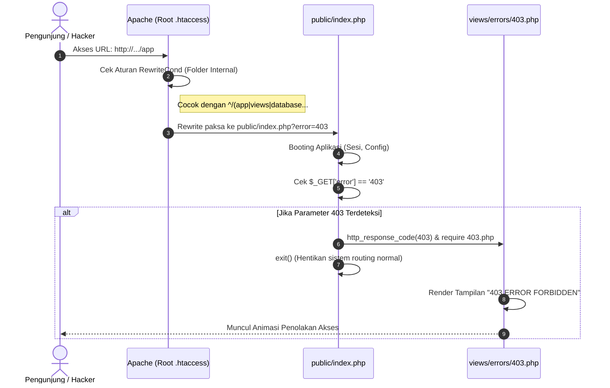

# Dokumentasi Teknis Perubahan Sistem KSP Harapan Mulya

*(Berdasarkan Analisis Riwayat Walkthrough: `walk-11-06.md`)*

Dokumentasi ini merangkum seluruh perubahan kode, penambahan fitur halaman error 404 dan 403, perbaikan animasi wordsearch, implementasi *Clean URL*, dan proteksi direktori sistem yang berhasil diimplementasikan di **KSP Harapan Mulya** pada tanggal 11 Juni 2026.

---

## 📌 Ringkasan Fitur Utama yang Berhasil Dibangun

1. **Halaman Error 404 Kustom dengan Animasi Wordsearch**:

   - Implementasi halaman 404 (*Page Not Found*) yang interaktif, menggunakan konsep *wordsearch puzzle* yang menyala berurutan dengan animasi bertahap.
   - Grid menampilkan "404 PAGE NOT FOUND" untuk halaman tidak ditemukan, untuk halaman yang ditolak aksesnya.
   - Terdapat *easter egg*.
2. **Perbaikan Bug Animasi jQuery (Script.js)**:

   - Mengganti `$(this).delay().queue()` dengan pendekatan `setTimeout` *incremental delay* agar animasi menyala berurutan tidak tersendat dan dieksekusi dengan benar tanpa *bug* pemanggilan objek document.
3. **Perbaikan Tata Letak Grid CSS**:

   - Menambahkan aturan CSS `#wordsearch ul li:nth-child(8n) { margin-right: 0; }` guna membuang margin sisa di pinggir kanan dan mencegah baris jatuh (wrap) ke baris baru.
4. **Sistem Clean URL & Proteksi Folder (.htaccess Root)**:

   - Membuat file `.htaccess` di direktori *root* untuk secara otomatis (*silent redirect*) meneruskan semua permintaan ke dalam folder `/public/`. Hal ini menciptakan *Clean URL* murni tanpa `/public/` terekspos.
   - Menonaktifkan *Directory Listing* global dengan parameter `Options -Indexes`.
   - Mengamankan direktori rentan (seperti `app/`, `views/`, `database/`, `.git`) agar tidak bisa diintip. Akses langsung akan dicegat oleh *rewrite rule*!
5. **Navigasi Kembali ke Dashboard Terpusat**:

   - Menautkan tombol "Beranda" dari halaman error ke *endpoint* `url('/dashboard')`, yang mendeteksi sesi *login* secara cerdas dan melempar *user* (Admin, Teller, Ketua, atau Anggota) kembali ke dasbor masing-masing.

---

## 📊 Tabel Ringkasan File yang Dimodifikasi

Berikut daftar berkas yang mengalami perubahan pada siklus perbaikan ini:

| No | Lokasi File                                 | Status             | Kategori / Layer     | Deskripsi Singkat Perubahan                                                                                                 |
| -- | ------------------------------------------- | ------------------ | -------------------- | --------------------------------------------------------------------------------------------------------------------------- |
| 1  | `.htaccess` (Root)                        | **[NEW]**    | Server Config        | Menerapkan Clean URL, Options -Indexes, dan mencegat akses ke folder internal untuk diarahkan ke parameter `?error=403`.  |
| 2  | `request/404/dist/script.js`              | **[MODIFY]** | Template / Sumber    | Perbaikan animasi: mengganti `$(this).delay().queue()` dengan `setTimeout` agar huruf menyala berurutan.                |
| 3  | `request/404/dist/style.css`              | **[MODIFY]** | Template / Sumber    | Penambahan rule `nth-child(8n)` untuk tata letak grid presisi 8x8.                                                        |
| 4  | `public/assets/css/404.css` & `403.css` | **[NEW]**    | Aset Publik / CSS    | Aset*stylesheet* spesifik error page yang dipindahkan ke folder aset publik aplikasi.                                     |
| 5  | `public/assets/js/404.js` & `403.js`    | **[NEW]**    | Aset Publik / JS     | Aset*script* dengan *array* konfigurasi huruf animasi yang di-*support* untuk 404 (15 kata) dan 403 (17 kata).        |
| 6  | `views/errors/404.php`                    | **[NEW]**    | Views / Error        | Template UI "Page Not Found".                                                                                               |
| 7  | `views/errors/403.php`                    | **[NEW]**    | Views / Error        | Template UI "Error Forbidden".                                                                                              |
| 8  | `public/index.php`                        | **[MODIFY]** | Routing / Controller | Menambahkan detektor get variabel `?error=403`, mendaftarkan *route* `/403`, dan mengubah perilaku `setNotFound()`. |

---

## 🔄 Visualisasi Alur Penanganan Security & Clean URL (Mermaid Diagram)

Berikut adalah logika brilian di belakang layar saat orang tak diundang mengakses folder sensitif kita (misal: `/app`):



---

## 🏗️ Struktur Direktori Baru

```
Ksp_Koperasinat/
├── .htaccess                         ← [NEW] Pengawal Pintu Utama & Clean URL
├── public/
│   ├── assets/
│   │   ├── css/
│   │   │   ├── 403.css               ← [NEW]
│   │   │   └── 404.css               ← [NEW]
│   │   └── js/
│   │       ├── 403.js                ← [NEW]
│   │       └── 404.js                ← [NEW]
│   ├── .htaccess                     ← Penerus ke index.php
│   └── index.php                     ← [MODIFY] Sistem router untuk 403 & 404
├── views/
│   └── errors/
│       ├── 403.php                   ← [NEW] 
│       └── 404.php                   ← [NEW] 
└── request/
    └── 404/
        └── dist/                     ← [MODIFY] Template asal telah diperbaiki
```

---

> [!NOTE]
> Branch Git: `fitur/clean_url` dan `fitur/404_Error`. Branch telah berhasil di-checkout. Perubahan ini secara teknis telah membuat sistem Koperasi memiliki standar arsitektur "Clean & Hidden URL" yang profesional, aman dari pencurian kode sumber, dan ramah pengunjung!
