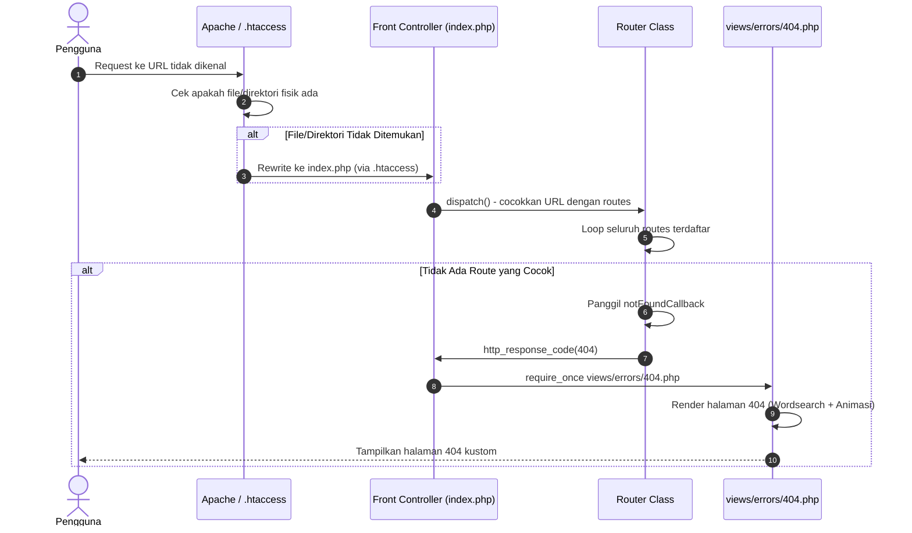

# Dokumentasi Teknis Perubahan Sistem KSP Harapan Mulya

*(Berdasarkan Analisis Riwayat Walkthrough: `walk-11-06.md`)*

Dokumentasi ini merangkum seluruh perubahan kode, penambahan fitur halaman error 404, perbaikan animasi wordsearch, dan integrasi template ke dalam sistem routing aplikasi yang berhasil diimplementasikan di **KSP Harapan Mulya** pada tanggal 11 Juni 2026.

---

## 📌 Ringkasan Fitur Utama yang Berhasil Dibangun

1. **Halaman Error 404 Kustom dengan Animasi Wordsearch**:
   - Implementasi halaman 404 (*Page Not Found*) yang interaktif dan estetis, menggunakan konsep *wordsearch puzzle* yang menampilkan kata-kata "404", "PAGE", "NOT", dan "FOUND" yang menyala secara berurutan dengan animasi bertahap.
   - Grid wordsearch berukuran 8×8 kotak menampilkan huruf-huruf acak dengan nama **YOGIE ARIO PRATAMA** tersembunyi di dalamnya sebagai *easter egg*.

2. **Perbaikan Bug Animasi jQuery (Script.js)**:
   - Kode animasi awal menggunakan `$(this).delay().queue()` yang merujuk ke objek `document`, sehingga antrean animasi jQuery tidak terpicu sama sekali.
   - Diperbaiki menggunakan pendekatan `setTimeout` dengan *incremental delay* (mulai dari 1500ms, bertambah 500ms per huruf), memastikan 15 huruf menyala secara berurutan sesuai kelas `.one` hingga `.fifteen`.

3. **Perbaikan Tata Letak Grid CSS**:
   - Ditambahkan aturan CSS `#wordsearch ul li:nth-child(8n) { margin-right: 0; }` untuk menghilangkan *margin* kanan pada elemen ke-8 di setiap baris, mencegah *wrapping* yang menyebabkan grid berantakan akibat pembulatan piksel browser.

4. **Perbaikan Pemuatan jQuery (Protocol-Relative URL)**:
   - URL pemuatan jQuery diubah dari *protocol-relative* (`//cdnjs.cloudflare.com/...`) menjadi *explicit HTTPS* (`https://cdnjs.cloudflare.com/...`) agar skrip dapat dimuat dengan benar baik melalui server lokal maupun saat dibuka langsung sebagai file HTML.

5. **Integrasi Template 404 ke Sistem Routing Aplikasi**:
   - Template 404 statis (`request/404/dist/`) berhasil diintegrasikan ke dalam arsitektur MVC aplikasi PHP.
   - File CSS dan JS dipindahkan ke direktori aset publik (`public/assets/css/404.css` dan `public/assets/js/404.js`).
   - View PHP dibuat di `views/errors/404.php` dengan referensi aset menggunakan *helper* `asset()` bawaan framework.
   - Handler 404 di router (`public/index.php`) diperbarui dari output HTML *inline* menjadi `require_once` ke file view yang terstruktur.

6. **Navigasi Kembali ke Dashboard dari Halaman 404**:
   - Tombol "Beranda" pada halaman 404 diarahkan ke `<?= url('/dashboard') ?>`, yang secara otomatis mendeteksi peran (*role*) pengguna yang sedang *login* (Admin, Teller, Ketua, atau Anggota) dan mengarahkan ke *dashboard* masing-masing.
   - Tombol "Contact" diarahkan ke `https://yogiario.my.id` sebagai tautan eksternal.

---

## 📊 Tabel Ringkasan File yang Dimodifikasi

Berikut daftar berkas yang mengalami perubahan pada siklus perbaikan ini:

| No | Lokasi File                                         | Status       | Kategori / Layer      | Deskripsi Singkat Perubahan                                                                                                |
| -- | --------------------------------------------------- | ------------ | --------------------- | -------------------------------------------------------------------------------------------------------------------------- |
| 1  | `request/404/dist/script.js`                        | **[MODIFY]** | Template / Sumber     | Perbaikan animasi: mengganti `$(this).delay().queue()` dengan `setTimeout` agar huruf menyala berurutan.                    |
| 2  | `request/404/dist/style.css`                        | **[MODIFY]** | Template / Sumber     | Penambahan rule `nth-child(8n)` untuk menghilangkan margin kanan pada kolom terakhir setiap baris grid.                     |
| 3  | `request/404/dist/index.html`                       | **[MODIFY]** | Template / Sumber     | Perbaikan URL jQuery (HTTPS eksplisit), perubahan teks konten ke Bahasa Indonesia, penyesuaian huruf grid.                  |
| 4  | `public/assets/css/404.css`                         | **[NEW]**    | Aset Publik / CSS     | Salinan `style.css` yang telah diperbaiki, ditempatkan di direktori aset publik untuk diakses oleh view PHP.                 |
| 5  | `public/assets/js/404.js`                           | **[NEW]**    | Aset Publik / JS      | Salinan `script.js` yang telah diperbaiki, ditempatkan di direktori aset publik untuk diakses oleh view PHP.                 |
| 6  | `views/errors/404.php`                              | **[NEW]**    | Views / Error         | View PHP halaman 404 dengan referensi aset menggunakan helper `asset()` dan navigasi dinamis menggunakan helper `url()`.    |
| 7  | `public/index.php`                                  | **[MODIFY]** | Routing / Controller  | Perubahan handler `setNotFound()` dari output HTML *inline* menjadi `require_once` ke `views/errors/404.php`.               |

---

## 🔄 Visualisasi Alur Penanganan Error 404 (Mermaid Diagram)

Berikut alur logika sistem ketika pengguna mengakses URL yang tidak terdaftar di router aplikasi:



---

## 🏗️ Struktur Direktori Baru

```
Ksp_Koperasinat/
├── public/
│   ├── assets/
│   │   ├── css/
│   │   │   └── 404.css              ← [NEW] Stylesheet halaman 404
│   │   └── js/
│   │       └── 404.js               ← [NEW] Script animasi wordsearch
│   ├── .htaccess                     ← Rewrite rule ke index.php
│   └── index.php                     ← [MODIFY] Handler 404 diperbarui
├── views/
│   └── errors/
│       └── 404.php                   ← [NEW] View halaman error 404
└── request/
    └── 404/
        └── dist/                     ← [MODIFY] Template sumber (diperbaiki)
            ├── index.html
            ├── script.js
            └── style.css
```

---

## ✅ Verifikasi Mandiri

Aplikasi web kini siap dijalankan! Silakan lakukan pengujian berikut:

1. **Test Halaman 404**: Akses URL yang tidak terdaftar di aplikasi (contoh: `http://[domain-anda]/halaman-tidak-ada`) dan pastikan halaman wordsearch 404 muncul dengan animasi menyala berurutan.
2. **Test Animasi**: Pastikan huruf-huruf "4", "0", "4", "P", "A", "G", "E", "N", "O", "T", "F", "O", "U", "N", "D" menyala secara berurutan dengan warna hijau (*teal*) setelah halaman dimuat.
3. **Test Navigasi**: Klik tombol "Beranda" pada halaman 404 dan pastikan Anda diarahkan kembali ke dashboard sesuai peran (*role*) Anda.
4. **Test Responsif**: Ubah ukuran jendela browser untuk memastikan grid wordsearch dan konten teks menyesuaikan tata letak secara responsif.

> [!NOTE]
> Branch Git: `fitur/404_Error`. Commit: *"Tahap awal pembuatan halaman 404"*. Branch telah berhasil di-push ke remote repository GitHub (`useripx/KSP_Harapan_Mulya`). Silakan buat Pull Request untuk merge ke branch utama.
