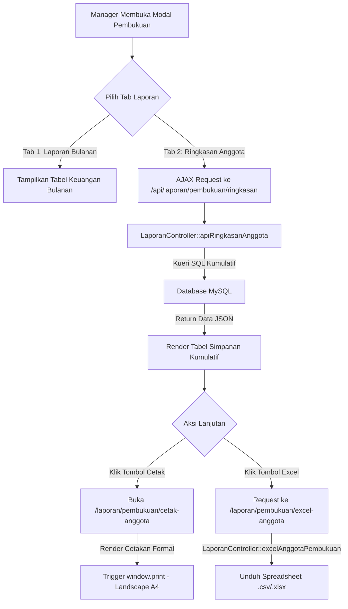

# Dokumentasi Teknis Perubahan Sistem KSP Harapan Mulya

*(Berdasarkan Analisis Riwayat Walkthrough: `walk-18-05.md`)*

Dokumentasi ini merangkum seluruh perubahan kode, penambahan fitur, optimalisasi antarmuka (UI/UX), dan migrasi data yang berhasil diimplementasikan di **KSP Harapan Mulya**.

---

## 📌 Ringkasan Fitur Utama yang Berhasil Dibangun

1. **Tab Navigasi Pratinjau Interaktif**:
   - Sistem tab modern (*Bulanan* & *Ringkasan Data Anggota*) pada modal pratinjau Manager dengan AJAX loader real-time untuk memuat data saldo simpanan kumulatif anggota secara dinamis.
2. **Cetak Ringkasan Anggota Formal (A4 Landscape)**:
   - Fitur cetak berstandar landscape yang bersih, menyembunyikan elemen navigasi web (`@media print`), serta menyertakan slot tanda tangan pengurus & validator.
3. **Ekspor Spreadsheet Excel / CSV**:
   - Fitur ekspor instan data akumulasi simpanan kumulatif anggota menggunakan helper native `excelResponse()`.
4. **Penyelarasan Tahun Dashboard Otomatis**:
   - Sinkronisasi preferensi tahun yang dipilih Manager menggunakan session (`$_SESSION['dashboard_selected_year']`) sehingga konsisten saat bernavigasi kembali ke dashboard.
5. **Modernisasi Modal & Mode Gelap Premium (Dark Mode)**:
   - Optimalisasi warna kartu, kisi penanggalan (*Calendar Picker*), teks grid, dan tombol di mode gelap menggunakan CSS variables.
6. **Pembaruan Alamat Pusat KSP Harapan Mulya**:
   - Pembaruan alamat kantor pusat baru secara konsisten di cetakan anggota dan kuitansi angsuran.
7. **Modal Konfirmasi Logout Premium**:
   - Migrasi dari konfirmasi bawaan browser (`confirm()`) ke modal konfirmasi premium terpusat secara global untuk seluruh peran pengguna.

---

## 📊 Tabel Ringkasan File yang Dimodifikasi & Dibuat

Berikut adalah daftar lengkap berkas yang mengalami perubahan (`[MODIFY]`) maupun yang ditambahkan baru (`[NEW]`):

| No | Lokasi File                                 | Status             | Kategori / Layer   | Deskripsi Singkat Perubahan                                                                           |
| -- | ------------------------------------------- | ------------------ | ------------------ | ----------------------------------------------------------------------------------------------------- |
| 1  | `public/index.php`                        | **[MODIFY]** | Routing & Session  | Registrasi rute cetak, ekspor excel, dan API endpoint ringkasan anggota.                              |
| 2  | `app/controllers/DashboardController.php` | **[MODIFY]** | Controller & Logic | Integrasi session filter tahun (`dashboard_selected_year`) di Dashboard Manager.                    |
| 3  | `app/controllers/LaporanController.php`   | **[MODIFY]** | Controller & Logic | Implementasi method cetak, ekspor excel, dan API endpoint JSON data kumulatif.                        |
| 4  | `views/layout/main.php`                   | **[MODIFY]** | Layout Global      | Penyematan markup & fungsi Javascript Modal Logout Premium secara global.                             |
| 5  | `views/layout/sidebar.php`                | **[MODIFY]** | Layout Global      | Mengalihkan tombol logout sidebar agar memicu Modal Logout Premium.                                   |
| 6  | `views/layout/topbar.php`                 | **[MODIFY]** | Layout Global      | Mengalihkan tombol logout dropdown topbar agar memicu Modal Logout Premium.                           |
| 7  | `views/laporan/pembukuan_lihat.php`       | **[MODIFY]** | Views Laporan      | Penambahan tab interface, AJAX loader data, tombol cetak/excel, dan perbaikan visual lencana status.  |
| 8  | `views/laporan/pembukuan.php`             | **[MODIFY]** | Views Laporan      | Adaptasi visual Calendar Picker, kartu aksi, grid, dan tombol agar kompatibel penuh dengan Dark Mode. |
| 9  | `views/laporan/cetak_anggota.php`         | **[NEW]**    | Views Laporan      | File template cetak landscape A4 formal dengan tanda tangan validator dan alamat terbaru.             |
| 10 | `views/angsuran/detail.php`               | **[MODIFY]** | Views Angsuran     | Pembaruan alamat kantor pusat baru pada footer kuitansi angsuran.                                     |
| 11 | `views/laporan/pembukuan_kirim.php`       | **[MODIFY]** | Views Laporan      | Modernisasi alur animasi popup pengiriman laporan ke BAU dengan checkmark sukses interaktif.          |

---

## 🔍 Detail Perubahan Kode per Komponen

### 1. Routing & Logika Backend (Controller)

* **`public/index.php`**
  * Mendaftarkan rute baru untuk mendukung pencetakan laporan dan pengunduhan spreadsheet:
    * `/laporan/pembukuan/cetak-anggota` $\rightarrow$ memanggil `LaporanController@cetakAnggotaPembukuan`
    * `/laporan/pembukuan/excel-anggota` $\rightarrow$ memanggil `LaporanController@excelAnggotaPembukuan`
    * `/api/laporan/pembukuan/ringkasan` $\rightarrow$ memanggil `LaporanController@apiRingkasanAnggota`
* **`app/controllers/DashboardController.php`**
  * Mengubah mekanisme pembacaan tahun aktif di dashboard Manager agar memprioritaskan session:
    ```php
    $selectedYear = isset($_GET['year']) ? (int)$_GET['year'] : ($_SESSION['dashboard_selected_year'] ?? (int)date('Y'));
    if (isset($_GET['year'])) {
        $_SESSION['dashboard_selected_year'] = (int)$_GET['year'];
    }
    ```
* **`app/controllers/LaporanController.php`**
  * Menambahkan method `apiRingkasanAnggota()` untuk menyediakan data saldo simpanan kumulatif anggota aktif secara dinamis dalam bentuk JSON.
  * Menambahkan method `cetakAnggotaPembukuan()` yang mengambil data anggota dan menyajikannya ke halaman cetak khusus.
  * Menambahkan method `excelAnggotaPembukuan()` yang menyusun *data stream* tabular untuk diunduh sebagai berkas `.csv`/`.xlsx` via `excelResponse()`.

---

### 2. Layout Global & Keamanan (Modal Logout)

* **`views/layout/main.php`**
  * Menambahkan kerangka Modal Bootstrap di akhir body sebagai komponen modal logout global yang elegan:
    ```html
    <!-- Modal Logout Premium -->
    <div class="modal fade" id="logoutConfirmModal" tabindex="-1" aria-hidden="true">
        <div class="modal-dialog modal-dialog-centered">
            <div class="modal-content shadow-lg border-0 rounded-4"> ... </div>
        </div>
    </div>
    ```
  * Menyediakan fungsi Javascript global:
    ```javascript
    function showLogoutModal() {
        var myModal = new bootstrap.Modal(document.getElementById('logoutConfirmModal'));
        myModal.show();
    }
    ```
* **`views/layout/sidebar.php` & `views/layout/topbar.php`**
  * Mengganti pemanggilan fungsi konfirmasi bawaan browser yang terkesan kuno dengan pencegahan event default dan pengalihan ke modal interaktif baru:
    ```html
    <!-- Sebelum -->
    <a href="<?= url('/logout') ?>" onclick="return confirm('Apakah Anda yakin ingin keluar?')">

    <!-- Sesudah -->
    <a href="<?= url('/logout') ?>" onclick="event.preventDefault(); showLogoutModal();">
    ```

---

### 3. Tampilan Laporan & Optimalisasi Dark Mode (Views)

* **`views/laporan/pembukuan.php`**
  * Melakukan pemetaan ulang elemen modal dan picker dengan variabel CSS (`var(--card)`, `var(--foreground)`, `var(--border)`) agar saat mode gelap aktif, picker kalender tidak silau/salah warna dan teks dropdown tetap terbaca jelas.
* **`views/laporan/pembukuan_lihat.php`**
  * Menambahkan sistem tab yang memisahkan pratinjau:
    1. **Tab Laporan Keuangan Bulanan**
    2. **Tab Ringkasan Data Anggota** (memuat tabel AJAX loader saldo kumulatif: Wajib, Pokok, Sukarela, Belanja, Sosial, Motor, Mobil).
  * Menyematkan tombol cepat **Cetak Anggota** dan **Ekspor Excel** di sisi atas tab ringkasan.
  * Menerapkan penyesuaian visual warna teks badges dengan `!important` untuk menjamin kontras tinggi di mode gelap.
* **`views/laporan/pembukuan_kirim.php`**
  * Membangun ulang modal umpan balik setelah pengiriman berkas pembukuan ke BAU. Kini dilengkapi visual checkmark interaktif, status sukses berukuran besar, log riwayat persisten, dan tombol konfirmasi "Oke" yang menutup modal dengan mulus.

---

### 4. Cetak & Pembaruan Alamat Kantor Pusat

* **`views/laporan/cetak_anggota.php` `[NEW]`**
  * Merupakan file template cetak berorientasi landscape A4 yang baru dibuat.
  * Menyembunyikan tombol aksi menggunakan aturan CSS `@media print`:
    ```css
    @media print {
        .no-print, .btn, .navbar, .sidebar {
            display: none !important;
        }
        body {
            background: #fff;
            color: #000;
        }
    }
    ```
  * Mencantumkan alamat pusat KSP Harapan Mulya yang baru terverifikasi di header surat.
* **`views/angsuran/detail.php`**
  * Memperbarui alamat kantor fisik di bagian footer struk kuitansi angsuran agar selaras dengan pemindahan domisili kantor operasional yang baru.

---

## 🔄 Visualisasi Aliran Data Ringkasan Anggota (Mermaid Diagram)

Berikut diagram yang menggambarkan proses pemuatan, pencetakan, dan pengeksporan data ringkasan anggota yang diakses oleh Manager:



---

> [!NOTE]
> Seluruh perubahan telah diuji dan terintegrasi secara modular ke dalam arsitektur MVC (Model-View-Controller) aplikasi, memastikan bahwa perubahan visual di sisi Manager tidak mengganggu operasional sistem di sisi Teller, Validator, maupun Anggota.
>
