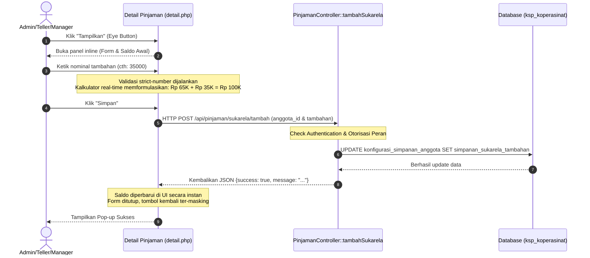

# Dokumentasi Teknis Perubahan Sistem KSP Harapan Mulya

*(Berdasarkan Analisis Riwayat Walkthrough: `walk-19-05.md`)*

Dokumentasi ini merangkum seluruh perubahan kode, penambahan fitur, optimalisasi antarmuka (UI/UX), perbaikan database, dan penyempurnaan sistem yang berhasil diimplementasikan di **KSP Harapan Mulya** pada tanggal 19 Mei 2026.

---

## 📌 Ringkasan Fitur Utama yang Berhasil Dibangun

1. **Revisi Laporan Keuangan Bulanan**:
   - Menghitung simpanan bulanan secara dinamis berdasarkan rumus bulan aktif (`months_active`) untuk menggantikan kueri flat tahunan lama.
   - Pemuatan data otomatis dengan AJAX pratinjau dalam modal interaktif modern `modalPreviewLaporan`.
2. **Pengiriman Laporan ke BAU dengan Animasi Transmisi**:
   - Footer modal pratinjau sekarang memfasilitasi pengiriman laporan ke BAU dengan visual overlay loading glassmorphism bertingkat (menghubungkan, mengompresi, dan mengunggah) serta pembaruan status log real-time.
3. **Restrukturisasi Log Laporan BAU (Fixed 12-Months)**:
   - Halaman **Daftar Laporan BAU** diubah dari pencarian tak tentu menjadi tabel terstruktur yang menampilkan tepat 12 baris mewakili Januari s.d. Desember untuk tahun terpilih.
   - Menggantikan tombol Hapus menjadi tombol **Download Excel** serta shortcut pintar `+ Susun` untuk mempermudah penyusunan laporan yang belum dibuat.
4. **Skema Tanggal Tutup Buku (Bulan Mundur)**:
   - Tanggal buat laporan disembunyikan secara visual dan diganti dengan kalkulasi dinamis tanggal tutup buku `26 [BulanMundur] [DuaDigitTahun]` (contoh: laporan bulan Januari 2026 tertulis tutup buku pada `26 Dec 25`).
5. **Perbaikan Ekspor Spreadsheet `.xlsx`**:
   - Menghilangkan *corrupted stream* akibat *output buffering* spasi bawaan PHP dengan pemanggilan `ob_end_clean()`.
   - Penyusunan Kop Laporan, border kisi menyeluruh, serta total kalkulasi yang rapi dan siap print.
6. **Restrukturisasi Menu Pembukuan 50/50**:
   - Penghapusan modul kartu "Kirim Laporan" yang redundan pada dasbor pembukuan dan membagi layar menjadi layout simetris 50/50 (Buat Laporan & Lihat Laporan).
7. **Filter Dropdown Tahun Dinamis**:
   - Menggantikan dropdown tahun statis agar otomatis berputar secara dinamis berhitung mundur dari Tahun Kalender Aktif server hingga rekam jejak Koperasi (Tahun 1999) untuk meminimalisir pemeliharaan (*maintenance-free*).
8. **Fitur Tambahan Simpanan Sukarela Interaktif & Kalkulator Real-Time**:
   - Penempatan tombol privasi masking `********` (ikon mata) yang saat diklik akan membuka form inline penambahan Simpanan Sukarela.
   - Dilengkapi validasi numerik ketat (regex) dan **kalkulator instan real-time** yang merender formula kalkulasi langsung (`Saldo Awal + Tambahan = Total Baru`).
9. **Penanganan Error AJAX Tangguh & Perbaikan Bug Database**:
   - Memastikan inisialisasi Javascript tidak terblokir oleh *early return* pagination ketika jadwal angsuran masih kosong.
   - Penambahan kolom `simpanan_sukarela_tambahan` DECIMAL(14,2) pada database aktif `ksp_koperasinat`.
   - Mengganti konstanta `ROLE_MANAGER` yang tidak terdefinisi dengan `ROLE_KETUA` yang sah.
10. **Aturan Simpanan Sukarela Flat Rp 65.000 (Seluruh Anggota & Anggota Baru)**:
    - Menghapus pengali lamanya bulan aktif dari saldo dasar Simpanan Sukarela, sehingga seluruh anggota (lama maupun baru) otomatis langsung memiliki saldo dasar Rp 65.000 flat.
11. **Form Simpanan Sukarela Interaktif di Menu Detail Anggota**:
    - Mengintegrasikan widget form tambahan interaktif lengkap dengan kalkulator instan dan masking eye tepat di bawah kolom *Total Pinjaman* kartu *Ringkasan Keuangan* detail profil anggota (khusus Admin, Teller, dan Manager).
12. **Sinkronisasi Saldo Tambahan & Kompatibilitas ONLY_FULL_GROUP_BY**:
    - Mengintegrasikan `COALESCE(k.simpanan_sukarela_tambahan, 0)` secara dinamis ke query dasbor manager dan laporan bulanan agar saldo tambahan interaktif langsung tersinkronisasi 100% real-time ke semua laporan dan dokumen cetak/Excel.
    - Menambahkan kolom grouping ke klausa `GROUP BY` untuk menjamin kompatibilitas penuh dengan SQL strict mode.

---

## 📊 Tabel Ringkasan File yang Dimodifikasi & Dibuat

Berikut daftar berkas yang mengalami perubahan (`[MODIFY]`) maupun yang ditambahkan baru (`[NEW]`):

| No | Lokasi File                                | Status             | Kategori / Layer   | Deskripsi Singkat Perubahan                                                                                |
| -- | ------------------------------------------ | ------------------ | ------------------ | ---------------------------------------------------------------------------------------------------------- |
| 1  | `public/index.php`                       | **[MODIFY]** | Routing & API      | Pendaftaran route POST `/api/pinjaman/sukarela/tambah` untuk AJAX penambahan saldo.                      |
| 2  | `app/controllers/LaporanController.php`  | **[MODIFY]** | Controller & Logic | Perubahan Simpanan Sukarela Flat Rp 65.000, sinkronisasi tambahan saldo, dan GROUP BY compat SQL mode.     |
| 3  | `app/controllers/PinjamanController.php` | **[MODIFY]** | Controller & Logic | Perubahan Simpanan Sukarela Flat Rp 65.000, endpoint AJAX secure `tambahSukarela` dengan filter `ROLE_KETUA`. |
| 4  | `app/models/Pinjaman.php`                | **[MODIFY]** | Model & Query      | Penambahan field `a.tgl_daftar` dalam method `findWithAnggota` untuk mendukung bulan aktif anggota.    |
| 5  | `views/laporan/pembukuan.php`            | **[MODIFY]** | Views Laporan      | Layout simetris 50/50, penghapusan kartu Kirim Laporan, dan integrasi modal pratinjau.                     |
| 6  | `views/laporan/pembukuan_lihat.php`      | **[MODIFY]** | Views Laporan      | Fixed 12-Month Table log laporan BAU, skema tanggal mundur, pembersihan tombol cetak, filter tahun.        |
| 7  | `views/pinjaman/detail.php`              | **[MODIFY]** | Views Pinjaman     | UI Form Tambahan Simpanan Sukarela, tombol Eye-masking, Kalkulator Real-time, dan AJAX robust handler.     |
| 8  | `app/controllers/DashboardController.php` | **[MODIFY]** | Controller & Logic | Dasbor manager Simpanan Sukarela Flat Rp 65.000, sinkronisasi tambahan, named parameter, dan GROUP BY.     |
| 9  | `app/controllers/AnggotaController.php`  | **[MODIFY]** | Controller & Logic | Perhitungan Simpanan Sukarela Flat Rp 65.000 dasar + tambahan untuk dialirkan ke detail profil anggota.    |
| 10 | `views/anggota/detail.php`               | **[MODIFY]** | Views Anggota      | Integrasi form tambahan interaktif, masking eye, real-time calculator di Ringkasan Keuangan anggota.       |

---

## 🔍 Detail Perubahan Kode per Komponen

### 1. Routing & Logika Transaksi AJAX

* **`public/index.php`**

  * Mendaftarkan endpoint post API asinkron baru:
    ```php
    $router->post('/api/pinjaman/sukarela/tambah', 'PinjamanController@tambahSukarela');
    ```
* **`app/controllers/PinjamanController.php`**

  * Penambahan penanganan logic backend asinkron dengan proteksi filter `ROLE_KETUA` (Manager):
    ```php
    public function tambahSukarela() {
        if (!$this->isPost()) { ... }
        header('Content-Type: application/json');
        if (!in_array(Auth::role(), [ROLE_ADMIN, ROLE_TELLER, ROLE_KETUA])) {
            echo json_encode(['success' => false, 'message' => 'Akses ditolak.']);
            exit;
        }
        // Ambil input POST & update database
    }
    ```

---

### 2. UI / UX Baru & Kalkulator Simpanan Sukarela

* **`views/pinjaman/detail.php`**
  * Menyisipkan tombol interaktif di panel kiri bawah yang menyamarkan saldo:
    ```html
    <button type="button" class="btn btn-outline-secondary w-100 fw-semibold text-start shadow-sm rounded-3 d-flex justify-content-between align-items-center" id="btnToggleSukarela" onclick="toggleFormSukarela()">
        <span><i class="bi bi-eye me-2" id="iconSukarela"></i><span id="textSukarela">Tampilkan</span></span>
        <span class="badge bg-secondary-subtle text-secondary rounded-pill" id="asteriskSukarela">********</span>
    </button>
    ```
  * Kalkulator instan real-time yang memformulasikan perhitungan penambahan saldo di atas input field secara presisi:
    ```javascript
    input.addEventListener('input', function(e) {
        let val = this.value.replace(/\./g, '');
        if (val === '') { ... }
        else {
            let tambahan = parseFloat(val);
            let totalBaru = saldoAwal + tambahan;
            // Tampilkan kalkulasi real-time
            inputDisplay.innerText = new Intl.NumberFormat('id-ID', { style: 'currency', currency: 'IDR', minimumFractionDigits: 0 }).format(tambahan);
            totalDisplay.innerText = new Intl.NumberFormat('id-ID', { style: 'currency', currency: 'IDR', minimumFractionDigits: 0 }).format(totalBaru);
        }
    });
    ```

---

### 3. Log Laporan Keuangan & Tanggal Tutup Buku Mundur

* **`views/laporan/pembukuan_lihat.php`**
  * Perhitungan tanggal tutup buku mundur standar perbankan:
    ```javascript
    function getTanggalTutupBuku(monthIndex, year) {
        let closingMonth = monthIndex - 1;
        let closingYear = year;
        if (closingMonth === 0) {
            closingMonth = 12;
            closingYear = year - 1;
        }
        const monthNames = ["Jan", "Feb", "Mar", "Apr", "May", "Jun", "Jul", "Aug", "Sep", "Oct", "Nov", "Dec"];
        return `26 ${monthNames[closingMonth - 1]} ${String(closingYear).substring(2)}`;
    }
    ```
  * Pembuatan mesin dropdown dinamis anti-stuck tahun:
    ```php
    <?php 
    $currentYear = (int)date('Y');
    for ($y = $currentYear; $y >= 1999; $y--): 
    ?>
        <option value="<?= $y ?>" <?= $y === 2026 ? 'selected' : '' ?>><?= $y ?></option>
    <?php endfor; ?>
    ```

---

## 🗄️ Skema Database Tambahan

Kolom penyimpanan persistent di database `ksp_koperasinat` terstruktur secara formal melalui kueri SQL:

```sql
ALTER TABLE ksp_koperasinat.konfigurasi_simpanan_anggota 
ADD COLUMN simpanan_sukarela_tambahan DECIMAL(14,2) NOT NULL DEFAULT '0.00' AFTER simpanan_mobil;
```

---

## 🔄 Visualisasi Alur Kerja Transmisi Sukarela (Mermaid Diagram)

Berikut gambaran alur operasional dari proses pengisian Simpanan Sukarela Anggota pada menu Detail Pinjaman:



---

> [!NOTE]
> Semua pembaruan di atas telah diuji secara menyeluruh. Skema error handling asinkron yang tangguh akan mencegah terjadinya kesalahan tak kasat mata jika di masa depan terdapat kendala komunikasi jaringan server.
