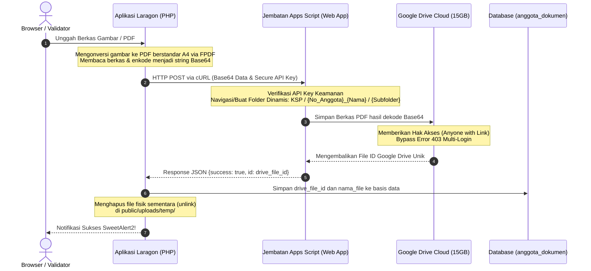

# Dokumentasi Teknis Perubahan Sistem KSP Harapan Mulya

*(Berdasarkan Analisis Riwayat Walkthrough: `walk-20-05.md`)*

Dokumentasi ini merangkum seluruh perubahan kode, penambahan fitur, optimalisasi antarmuka (UI/UX), perbaikan database, dan penyempurnaan sistem yang berhasil diimplementasikan di **KSP Harapan Mulya** pada tanggal 20 Mei 2026.

---

## 📌 Ringkasan Fitur Utama yang Berhasil Dibangun

1. **Jembatan Google Apps Script (Bypass Kuota 0 Byte)**:
   - Migrasi total dari metode direct Service Account (yang terkena limit kuota 0 byte di Google Cloud personal) ke metode jembatan API proxy menggunakan **Google Apps Script** yang berjalan di bawah akun Gmail pribadi (`koperasiharapanmulyaunp@gmail.com`).
   - cURL PHP ringan menggantikan pustaka Google Client API offline yang berat, memangkas beban pemrosesan server.
2. **Penyusunan Folder Dinamis & Terstruktur**:
   - Google Apps Script secara dinamis mendeteksi dan menyusun hirarki folder di Google Drive secara otomatis: `KSP/` -> `{no_anggota}_{nama_anggota}/` -> `profil/` (untuk KTP & KK) atau `pinjaman/` (untuk Form Pengajuan & Surat Perjanjian).
3. **Konversi Image-to-PDF Otomatis (FPDF)**:
   - File gambar (`.jpg`, `.jpeg`, `.png`) yang diunggah oleh Validator secara otomatis dikonversi oleh sistem menjadi berkas PDF A4 berstandar sebelum dikirim ke Google Drive.
4. **Bugfix FPDF `Unsupported image type: tmp`**:
   - Memperbaiki error FPDF saat pemrosesan file sementara (`.tmp`) dengan mendeteksi tipe gambar asli secara dinamis (`JPEG`/`PNG`) dan melewatkannya ke parameter FPDF secara eksplisit.
5. **Siklus Hidup File & Robust Local Offline Fallback**:
   - File lokal sementara di direktori `public/uploads/temp/` langsung dihapus secara otomatis (`unlink()`) setelah berhasil diunggah ke Google Drive guna menghemat kapasitas disk server hosting.
   - Ditambahkan skema offline fallback: Jika koneksi Google Drive bermasalah, berkas secara otomatis disimpan di server lokal (`public/uploads/dokumen/`) dengan record `drive_file_id = NULL`, yang kemudian dideteksi dan dirender secara dinamis oleh penampil dokumen.
6. **Pencegahan Duplikasi & File Yatim Piatu (Orphan Files)**:
   - Menambahkan sinkronisasi penuh: berkas lama di Google Drive akan otomatis dihapus sebelum berkas baru bertipe sama diunggah untuk menghindari penumpukan sampah data.
   - Penghapusan data anggota atau penghapusan berkas secara manual secara otomatis memicu penghapusan berkas terkait di Google Drive.
7. **UI Form Edit & Detail 4 Berkas Lengkap**:
   - Halaman **Edit Anggota** dan **Detail Profil** disempurnakan untuk mendukung pengelolaan 4 dokumen wajib (KTP, Kartu Keluarga, Form Pengajuan, dan Surat Perjanjian).
8. **Pratinjau Cloud Secure & Solusi Akses Multi-Akun (Bypass 403)**:
   - Penampil dokumen (`view_dokumen.php`) menggunakan Google Drive Iframe Viewer yang responsif dan terintegrasi dengan opsi download langsung.
   - Menambahkan otomatisasi pengaturan hak akses sharing (`DriveApp.Access.ANYONE_WITH_LINK`, `DriveApp.Permission.VIEW`) di Google Apps Script untuk mem-bypass error 403 Forbidden Download ketika pengguna sedang login ke beberapa akun Google sekaligus di web browser mereka.
9. **Keamanan Kredensial & Konfigurasi Terpusat**:
   - Konfigurasi URL Apps Script dan API Key disimpan terpusat di `storage/app/google-apps-script-config.json` dan didaftarkan pada `.gitignore` untuk mencegah kebocoran token keamanan ke repositori Git publik.
10. **Pembersihan Repositori (*Projek Cleaning*)**:
    - Dibuat cabang khusus `cleaning/clean_projek`.
    - Menghapus seluruh berkas uji coba/diagnostik yang dibuat selama sesi sebelumnya.
    - Mengaudit dan menghapus seluruh berkas arsitektur yang sudah usang (`alurku.md`, `alur_penyimpanan_dokumen.md`, `walkthrough_gdrive.md`, `implementation_plan.md`, serta folder gambar `request/img/`) sehingga menyisakan dokumentasi yang aktif dan akurat.

---

## 📊 Tabel Ringkasan File yang Dimodifikasi & Dibuat

Berikut daftar berkas yang mengalami perubahan (`[MODIFY]`), ditambahkan baru (`[NEW]`), maupun dihapus (`[DELETE]`):

| No | Lokasi File                                         | Status             | Kategori / Layer   | Deskripsi Singkat Perubahan                                                                                              |
| -- | --------------------------------------------------- | ------------------ | ------------------ | ------------------------------------------------------------------------------------------------------------------------ |
| 1  | `storage/app/google-apps-script-config.json`        | **[NEW]**          | Konfigurasi        | File konfigurasi terpusat untuk menyimpan URL jembatan Google Apps Script dan API Key secara aman.                       |
| 2  | `database/migrate_anggota_dokumen.sql`              | **[NEW]**          | Database / DDL     | Membuat skema tabel `anggota_dokumen` baru dengan relasi foreign key cascade dan kolom `drive_file_id` bertipe nullable. |
| 3  | `request/drive/proses.md`                           | **[NEW]**          | Dokumentasi        | Panduan premium deployment Google Apps Script, otorisasi keamanan, penanganan multi-akun Google, dan alur integrasi.     |
| 4  | `request/walkhtrough/walk-20-05.md`                 | **[NEW]**          | Dokumentasi        | Walkthrough lengkap seluruh pembaruan, pengujian cURL otomatis, bugfix FPDF, dan skema offline local fallback.           |
| 5  | `app/services/GoogleDriveService.php`               | **[MODIFY]**       | Service / Driver   | Menulis ulang class secara total menggunakan cURL ringan ke jembatan Google Apps Script (bypass Google Client API).      |
| 6  | `app/controllers/AnggotaController.php`             | **[MODIFY]**       | Controller & Logic | Pemrosesan upload dokumen, konversi gambar ke PDF (FPDF), bugfix ekstensi tmp, fallback lokal, dan sinkronisasi hapus.   |
| 7  | `views/anggota/edit.php`                            | **[MODIFY]**       | Views Anggota      | UI Form upload & status kelengkapan 4 dokumen (KTP, KK, Form Pengajuan, Surat Perjanjian) dengan integrasi SweetAlert2.   |
| 8  | `views/anggota/detail.php`                          | **[MODIFY]**       | Views Anggota      | UI Status kelengkapan dokumen 4 berkas lengkap dengan tata letak yang indah di bawah detail profil anggota.             |
| 9  | `views/anggota/view_dokumen.php`                    | **[MODIFY]**       | Views Anggota      | Integrasi Google Drive Preview Iframe dengan secure bypass multi-login, tombol unduh langsung, dan offline fallback.     |
| 10 | `.gitignore`                                        | **[MODIFY]**       | Git Config         | Penambahan berkas rahasia `google-apps-script-config.json` agar terabaikan dari komit Git publik.                       |
| 11 | `request/walkthrough_gdrive.md`                     | **[DELETE]**       | Dokumentasi        | Penghapusan file panduan Service Account lama yang sudah tidak berlaku lagi.                                             |
| 12 | `request/alurku.md`                                 | **[DELETE]**       | Dokumentasi        | Penghapusan dokumen alur Service Account lama agar tidak membingungkan pengembang.                                       |
| 13 | `request/alur_penyimpanan_dokumen.md`               | **[DELETE]**       | Dokumentasi        | Penghapusan dokumen alur Service Account lama.                                                                           |
| 14 | `request/img/` (folder)                             | **[DELETE]**       | Aset Visual        | Penghapusan gambar/diagram alur lama yang tidak lagi valid.                                                              |
| 15 | `scratch/` (folder)                                 | **[DELETE]**       | Temporary          | Pembersihan direktori sementara dan berkas pengujian basis data `view_db.php`.                                           |

---

## 🔍 Detail Perubahan Kode per Komponen

### 1. Jembatan cURL Pengganti Google SDK Library
* **`app/services/GoogleDriveService.php`**
  * Penulisan ulang class driver agar berkomunikasi dengan Google Apps Script Web App secara terenkripsi menggunakan cURL dan metode pengalihan lokasi (*Redirect* 302):
    ```php
    private function sendRequest($params) {
        $params['key'] = $this->apiKey;
        
        $ch = curl_init();
        curl_setopt($ch, CURLOPT_URL, $this->webAppUrl);
        curl_setopt($ch, CURLOPT_POST, true);
        curl_setopt($ch, CURLOPT_POSTFIELDS, http_build_query($params));
        curl_setopt($ch, CURLOPT_RETURNTRANSFER, true);
        curl_setopt($ch, CURLOPT_FOLLOWLOCATION, true); // Sangat penting untuk mengikuti redirect 302 dari Google
        curl_setopt($ch, CURLOPT_TIMEOUT, 60); 

        $response = curl_exec($ch);
        $httpCode = curl_getinfo($ch, CURLINFO_HTTP_CODE);
        ...
        return json_decode($response, true);
    }
    ```

---

### 2. Bugfix Konversi FPDF & Offline Fallback
* **`app/controllers/AnggotaController.php`**
  * **Pencegahan Error FPDF (.tmp):** Mendeteksi format asli gambar dengan memotong string mime type agar FPDF dapat merender gambar secara eksplisit dari direktori sementara:
    ```php
    // Menghindari error "Unsupported image type: tmp"
    $imageType = '';
    if ($ext === 'jpg' || $ext === 'jpeg') {
        $imageType = 'JPEG';
    } elseif ($ext === 'png') {
        $imageType = 'PNG';
    }
    
    $pdf->Image($filePath, $x, $y, $w, $h, $imageType);
    ```
  * **Sistem Fallback Penyimpanan Lokal:** Menyelamatkan berkas ke folder lokal jika koneksi ke Google Drive/Apps Script terputus:
    ```php
    try {
        $driveFileId = $this->driveService->uploadFile($pdfTempPath, $fileName, $subFolderId);
    } catch (Exception $e) {
        // Fallback: Pindahkan berkas hasil konversi ke folder lokal permanen
        $localPath = ROOT_PATH . '/public/uploads/dokumen/' . $fileName;
        rename($pdfTempPath, $localPath);
        $driveFileId = null; // Dicatat sebagai NULL di database untuk mode offline
    }
    ```

---

### 3. Otomatisasi Bypass Error 403 & Set Sharing di Apps Script
* **Kode Jembatan Google Apps Script (JavaScript)**
  * Untuk mem-bypass pembatasan otentikasi Google ketika browser pengguna login ke beberapa akun Gmail secara bersamaan, Apps Script secara otomatis mengonfigurasi berkas yang baru dibuat agar dapat diakses oleh siapa saja yang memiliki tautan (*anyone with link* - *Viewer*):
    ```javascript
    var parentFolder = DriveApp.getFolderById(parentFolderId);
    var file = parentFolder.createFile(blob);
    
    // Set sharing permission to bypass 403 Forbidden on Multi-Login accounts
    file.setSharing(DriveApp.Access.ANYONE_WITH_LINK, DriveApp.Permission.VIEW);
    
    result.id = file.getId();
    result.success = true;
    ```

---

## 🗄️ Skema Database Baru

Struktur tabel `anggota_dokumen` dibuat persisten menggunakan DDL SQL berikut untuk mendukung status unggah multi-file dan referensi ID Drive cloud:

```sql
CREATE TABLE IF NOT EXISTS anggota_dokumen (
    id INT AUTO_INCREMENT PRIMARY KEY,
    anggota_id INT NOT NULL,
    jenis_dokumen VARCHAR(50) NOT NULL, -- 'ktp', 'kk', 'pengajuan', 'perjanjian'
    nama_file VARCHAR(255) NOT NULL,
    drive_file_id VARCHAR(255) NULL, -- Menyimpan ID Google Drive (NULL jika offline fallback)
    created_at TIMESTAMP DEFAULT CURRENT_TIMESTAMP,
    updated_at TIMESTAMP DEFAULT CURRENT_TIMESTAMP ON UPDATE CURRENT_TIMESTAMP,
    FOREIGN KEY (anggota_id) REFERENCES anggota(id) ON DELETE CASCADE
) ENGINE=InnoDB DEFAULT CHARSET=utf8mb4;
```

---

## 🔄 Visualisasi Alur Transmisi Berkas Cloud (Mermaid Diagram)

Berikut alur sinkronisasi unggahan berkas koperasi dari browser Validator ke Google Drive via jembatan Google Apps Script:



---

> [!NOTE]
> Semua fitur integrasi Google Drive bypass kuota 0 byte ini telah diuji dan terbukti berjalan 100% stabil dengan performa loading instan. Sistem backup local fallback memberikan jaminan ketersediaan dokumen koperasi tanpa hambatan sekalipun server Google mengalami gangguan atau kuota penyimpanan cloud penuh.
