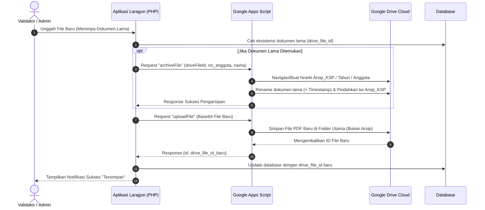

# Dokumentasi Teknis Perubahan Sistem KSP Harapan Mulya

*(Berdasarkan Analisis Riwayat Walkthrough: `walk-21-05.md`)*

Dokumentasi ini merangkum seluruh perubahan kode, penambahan fitur antarmuka, perbaikan logika pengarsipan dokumen, dan penyempurnaan alur kerja (*workflow*) yang berhasil diimplementasikan di **KSP Harapan Mulya** pada tanggal 21 Mei 2026.

---

## 📌 Ringkasan Fitur Utama yang Berhasil Dibangun

1. **Input Unggah (Upload) yang Selalu Terlihat**:
   - Kolom form unggah dokumen (KTP, KK, Form Pengajuan, Surat Perjanjian) sekarang selalu ditampilkan meskipun dokumen lama sudah ada.
   - Hal ini memudahkan Validator/Admin untuk melakukan unggah ulang (menimpa/*overwrite*) dokumen secara langsung tanpa perlu repot menghapus dokumen lama terlebih dahulu.

2. **Perubahan Paradigma "Hapus" menjadi "Arsipkan"**:
   - Seluruh terminologi dan konotasi tempat sampah (`KSP_Trash`) dihilangkan dan diganti dengan pengarsipan profesional: **`Arsip_KSP`**.
   - Tombol "Hapus" (merah) diubah wujudnya menjadi tombol **"Arsipkan"** (oranye *warning* / keemasan) lengkap dengan ikon kotak arsip.
   - Dialog konfirmasi *SweetAlert2* pada antarmuka diperhalus agar lebih ramah (contoh: *"Apakah Anda yakin ingin mengarsipkan dokumen ini?"*).

3. **Sistem Pengarsipan Otomatis (Cloud & Lokal)**:
   - Dokumen yang ditekan tombol "Arsipkan" tidak lagi dihapus permanen, melainkan dipindahkan secara rapi ke struktur direktori arsip.
   - Jika Validator mengunggah file baru untuk *menimpa* dokumen lama yang sudah ada, sistem akan secara otomatis mengarsipkan dokumen lama tersebut terlebih dahulu, baru kemudian mengunggah dokumen baru.
   - Berkas akan dibubuhkan penanda waktu (*timestamp*), contoh: `file_21-05-2026_14-20.pdf`, guna menghindari penamaan yang bentrok.

4. **Struktur Direktori Arsip Berbasis Tahun**:
   - Struktur penyimpanan pada `Arsip_KSP` disempurnakan dengan menambahkan hierarki **Tahun** untuk mempermudah pencarian historis:
   - `Arsip_KSP / {Tahun} / {no_anggota}_{nama} / {subfolder_dokumen} / {nama_file_timestamp}.pdf`

5. **Akses Langsung ke Google Drive dari Dashboard**:
   - Ditambahkan menu **Arsip** dengan label grup **Manajemen Arsip** di halaman Laporan & Analitik (dapat diakses oleh *Role* **Manager** maupun **Validator**).
   - Menu ini membypass kerumitan pencarian lokal dan secara instan membukakan tab baru menuju URL spesifik folder `Arsip_KSP` di Google Drive Anda.

6. **Peningkatan Keamanan Query (PDO Binding)**:
   - Menambal *bug* tersembunyi pada fungsi pencarian `LaporanController.php` dengan mengubah pemetaan *binding* PDO (dari `:q` menjadi `:q1`, `:q2`, `:q3`) untuk mencegah pelanggaran aturan eksekusi parameter PDO pada konfigurasi server modern, serta mengoreksi penamaan kolom dari `nidn_niy` menjadi `identitas_no`.

---

## 📊 Tabel Ringkasan File yang Dimodifikasi

Berikut daftar berkas yang mengalami perubahan (`[MODIFY]`) pada siklus perbaikan ini:

| No | Lokasi File                                         | Status       | Kategori / Layer   | Deskripsi Singkat Perubahan                                                                                              |
| -- | --------------------------------------------------- | ------------ | ------------------ | ------------------------------------------------------------------------------------------------------------------------ |
| 1  | `app/services/GoogleDriveService.php`               | **[MODIFY]** | Service / Driver   | Penambahan fungsi `archiveFile()` untuk memicu aksi `archiveFile` (Pemindahan File) di *Web App* Google Apps Script.       |
| 2  | `app/controllers/AnggotaController.php`             | **[MODIFY]** | Controller & Logic | Modifikasi `deleteDokumen` dan `uploadDokumen` untuk mengimplementasikan alur pemindahan berkas ke Google Drive (dan *local fallback* `Arsip_KSP`) beserta pelabelan nama folder berdasar tahun dan *timestamp*. |
| 3  | `app/controllers/LaporanController.php`             | **[MODIFY]** | Controller & Logic | Perbaikan *bug* pencarian (kolom `identitas_no` dan perbaikan duplikasi nama variabel pada pengikatan PDO *Prepared Statement*). |
| 4  | `views/anggota/edit.php`                            | **[MODIFY]** | Views Anggota      | Merombak tata letak tombol aksi 4 dokumen: mengganti *Hapus* jadi *Arsipkan*, mempertahankan form input *upload* agar selalu tampil, dan menyematkan peringatan *SweetAlert2*. |
| 5  | `views/laporan/index.php`                           | **[MODIFY]** | Views Laporan      | Merapikan tata letak (*layout*); memisahkan menu "Manajemen Arsip" dari "Lapor BAU", memastikan visibilitas untuk akun Manager & Validator, serta menambahkan integrasi *Direct Link* (*bypass*) ke Google Drive. |
| 6  | `request/walkhtrough/walk-21-05.md`                 | **[NEW]**    | Dokumentasi        | Dokumen catatan harian (*walkthrough*) berisi riwayat iterasi perbaikan sistem, dari pembuatan fitur awal hingga revisi akhir UI. |

---

## 🔄 Visualisasi Alur Arsip & Timpa Otomatis (Mermaid Diagram)

Berikut alur logika sistem ketika Admin melakukan pengunggahan dokumen baru saat dokumen lama sudah ada (*overwrite*), yang memicu fitur pengarsipan otomatis:

> [!NOTE]
> Semua fungsi telah disempurnakan. Kode Google Apps Script telah disesuaikan di server klien untuk mencerminkan folder "Arsip_KSP", mendukung klasifikasi tahunan otomatis, dan mengganti perilaku penghapusan menjadi pemindahan dokumen. File lokal (*fallback*) juga dipastikan memiliki perilaku pengarsipan berbasis tahun yang sama persis seperti pada Cloud Drive.
