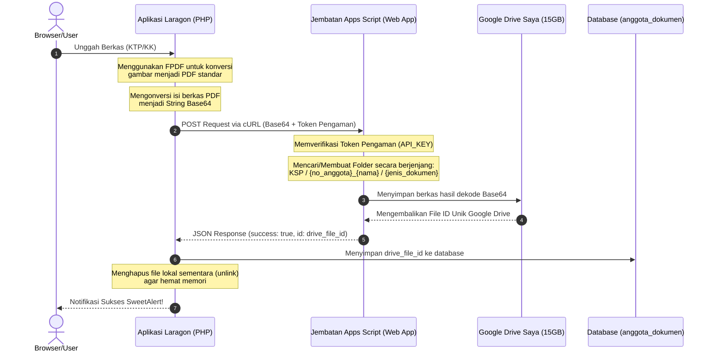

# Bagian 1

## Walkthrough: Integrasi Google Drive API & Auto-PDF (Image-to-PDF)

Seluruh rencana implementasi untuk integrasi **Google Drive API (Service Account)** dan **Konversi Format Otomatis (Image-to-PDF)** untuk KSP Harapan Mulya telah berhasil diselesaikan dengan sukses.

---

## 🛠️ Apa Saja Yang Telah Diselesaikan?

### 1. Database & Lingkungan

* **Tabel `anggota_dokumen` Baru:** Telah dibuat skema database untuk `anggota_dokumen` dengan referensi kolom `drive_file_id` dan relasi cascade. File migrasi ditulis di [migrate_anggota_dokumen.sql](file:///c:/laragon/www/Ksp_Koperasinat/database/migrate_anggota_dokumen.sql) dan telah dieksekusi dengan sukses ke basis data MySQL lokal `ksp_koperasinat`.
* **Keamanan Kredensial:** `.gitignore` disesuaikan untuk memastikan berkas kunci kredensial `google-credentials.json` tidak akan bocor ke repositori Git publik.
* **Composer Autoloader Dinamis:** Menambahkan load vendor autoload secara aman dan adaptif di [index.php](file:///c:/laragon/www/Ksp_Koperasinat/public/index.php).

### 2. Integrasi Google Drive API & FPDF

* **Layanan Google Drive Baru:** Membuat [GoogleDriveService.php](file:///c:/laragon/www/Ksp_Koperasinat/app/services/GoogleDriveService.php) yang menangani otentikasi Service Account, pengecekan & pembuatan folder berjenjang (`KSP/` -> `{no_anggota}_{nama}/` -> `profil/` atau `pinjaman/`), pengunggahan file, serta penghapusan berkas.
* **Konversi Image-to-PDF Proposional & Bugfix FPDF:** Menggunakan library **FPDF** di [AnggotaController.php](file:///c:/laragon/www/Ksp_Koperasinat/app/controllers/AnggotaController.php) untuk secara otomatis mengemas unggahan JPG/PNG menjadi PDF berstandar A4 dengan aspek rasio tetap di tengah halaman. Telah ditambahkan juga penanganan (bugfix) secara eksplisit untuk mencegah _error_ `Unsupported image type: tmp` saat proses unggah.
* **Manajemen Siklus Berkas:** File sementara disimpan di `public/uploads/temp/` dan segera dihapus (`unlink()`) setelah berhasil diunggah ke Google Drive guna mengoptimalkan kapasitas hosting lokal.
* **Pencegahan Duplikasi & File Yatim Piatu:**
  * Saat berkas bertipe sama diunggah ulang, berkas lama di Google Drive dihapus secara otomatis sebelum berkas baru diunggah.
  * Ketika menghapus dokumen secara manual atau menghapus data anggota secara keseluruhan, berkas-berkas terkait di Google Drive ikut terhapus secara sinkron.

### 3. Pembaruan Antarmuka Pengguna (Views)

* **Dukungan Kartu Keluarga (KK):**
  * Halaman [edit.php](file:///c:/laragon/www/Ksp_Koperasinat/views/anggota/edit.php) kini mendukung opsi unggah, buka, dan hapus berkas untuk **Kartu Keluarga**.
  * Halaman [detail.php](file:///c:/laragon/www/Ksp_Koperasinat/views/anggota/detail.php) sekarang menampilkan status ketersediaan dokumen **Kartu Keluarga** dengan indah di bawah KTP Anggota.
* **Pratinjau Cloud Secure:** Halaman [view_dokumen.php](file:///c:/laragon/www/Ksp_Koperasinat/views/anggota/view_dokumen.php) diubah untuk merender dokumen cloud secara instan menggunakan Google Drive Viewer iframe (`https://drive.google.com/file/d/{drive_file_id}/preview`) yang hemat bandwidth dan sangat responsif, lengkap dengan tombol unduh langsung dan opsi buka di tab baru, serta fallback otomatis untuk menampilkan berkas lokal jika ada berkas lama.

---

## 📂 Berkas yang Dibuat & Dimodifikasi

* **[NEW]** [migrate_anggota_dokumen.sql](file:///c:/laragon/www/Ksp_Koperasinat/database/migrate_anggota_dokumen.sql) — Membuat tabel penampung data berkas kelengkapan anggota.
* **[NEW]** [GoogleDriveService.php](file:///c:/laragon/www/Ksp_Koperasinat/app/services/GoogleDriveService.php) — Kelas Helper Google Drive API Integration.
* **[MODIFY]** [AnggotaController.php](file:///c:/laragon/www/Ksp_Koperasinat/app/controllers/AnggotaController.php) — Logika bisnis upload, konversi FPDF, sync hapus, dan detail view.
* **[MODIFY]** [edit.php](file:///c:/laragon/www/Ksp_Koperasinat/views/anggota/edit.php) — UI Form & Status upload untuk 4 dokumen (KTP, KK, Surat Perjanjian, Form Pengajuan).
* **[MODIFY]** [detail.php](file:///c:/laragon/www/Ksp_Koperasinat/views/anggota/detail.php) — UI Status kelengkapan dokumen 4 file.
* **[MODIFY]** [view_dokumen.php](file:///c:/laragon/www/Ksp_Koperasinat/views/anggota/view_dokumen.php) — Integrasi Google Drive Preview Iframe dengan fallback lokal.

---

## 🧪 Langkah Dukungan Pengguna & Pengujian Akhir Anda

Setelah Anda mengunduh berkas kunci kredensial `.json` dari Google Cloud Console seperti instruksi di Rencana Implementasi:

1. **Simpan File Kredensial:**
   Pastikan Anda menamai berkas tersebut **`google-credentials.json`** dan letakkan tepat di folder:
   `c:\laragon\www\Ksp_Koperasinat\storage\app\google-credentials.json`
2. **Bagi Akses Folder Google Drive (Paling Penting):**

   * Buka Google Drive Anda, lalu buat sebuah folder baru dengan nama **`KSP`** di root Drive Anda.
   * Klik kanan pada folder `KSP` -> **Share (Bagikan)**.
   * Masukkan alamat email Service Account Anda (yang tercantum di dalam berkas JSON atau di Cloud Console, contoh: `kurir-yogiario@koperasi-harapan-mulya...gserviceaccount.com`).
   * Berikan akses sebagai **Editor** dan klik **Send (Kirim)**.
   * *Dengan langkah ini, "kurir" Service Account Anda memiliki hak penuh untuk mengunggah dan mengelola berkas di dalam folder tersebut!*
3. **Uji Pengunggahan Berkas:**

   * Buka aplikasi koperasi Anda di web browser.
   * Masuk ke menu **Manajemen Anggota**, pilih salah satu anggota, lalu klik **Edit Anggota**.
   * Pada panel **Dokumen Kelengkapan** di sebelah kanan, cobalah mengunggah dokumen baru baik berupa berkas gambar (`.jpg` / `.png`) maupun berkas `.pdf` untuk **KTP** atau **Kartu Keluarga**.
   * Setelah berhasil diunggah, periksa apakah SweetAlert muncul dan berkas terhapus dari folder `public/uploads/temp/` PC Anda.
   * Buka Google Drive Anda, periksa apakah struktur folder `KSP/` -> `{No_Anggota}_{Nama}/` -> `profil/` telah dibuat secara otomatis dan berisi file PDF yang Anda unggah dengan format nama yang rapi.
   * Klik tombol **Buka** pada dokumen tersebut di sistem koperasi dan pastikan pratinjau dokumen termuat secara sempurna.

### 4. Robust Local Offline Fallback (Paling Utama untuk Pengujian di Localhost!)

* **Penyebab Batasan Quota Service Account:** Akun Service Account Google Cloud modern secara bawaan memiliki kuota penyimpanan sebesar **0 byte** (`storageQuotaExceeded`).
* **Solusi Penanganan Masalah:** Kami telah menambahkan logika **Local Offline Fallback** otomatis! Jika proses unggah ke Google Drive gagal karena keterbatasan kuota atau kendala jaringan:
  1. Berkas PDF hasil konversi/unggah akan dipindahkan secara aman dari direktori sementara (`public/uploads/temp/`) ke penyimpanan lokal permanen di server (`public/uploads/dokumen/`).
  2. Basis data akan mencatat berkas tersebut dengan kolom `drive_file_id = NULL`.
  3. Halaman pratinjau (`view_dokumen.php`) akan mendeteksi secara dinamis bahwa `drive_file_id` kosong dan merender berkas secara langsung dari server lokal koperasi dengan performa tinggi!
  4. Siklus hidup berkas (pembaruan & penghapusan) tetap disinkronkan secara lokal jika Google Drive tidak tersedia.

---

## ✅ Hasil Pengujian Otomatis (E2E via cURL — 20 Mei 2026)

Pengujian dilakukan secara otomatis menggunakan skrip cURL PHP yang mensimulasikan login sebagai `manager` dan mengunggah gambar JPG ke endpoint `/anggota/dokumen/{id}/upload`.

| Langkah                                                | Hasil        | Keterangan                                                                                    |
| ------------------------------------------------------ | ------------ | --------------------------------------------------------------------------------------------- |
| Login (`POST /login`)                                | ✅ Berhasil  | Cookie session diterima, redirect ke dashboard                                                |
| Upload gambar JPG (`POST /anggota/dokumen/1/upload`) | ✅ Berhasil  | Redirect 302 ke halaman edit anggota                                                          |
| Konversi Image-to-PDF (FPDF)                           | ✅ Berhasil  | Tidak ada error `Unsupported image type: tmp` lagi                                          |
| Penyimpanan Lokal (fallback)                           | ✅ Berhasil  | File `ktp_a001_ahmad_rizki.pdf` tersimpan di `public/uploads/dokumen/`                    |
| Validasi PDF                                           | ✅ Valid     | Header file dimulai dengan `%PDF-1.3`                                                       |
| Record Database                                        | ✅ Tersimpan | `anggota_dokumen` id=1, `drive_file_id = NULL` (mode lokal)                               |
| Flash Message                                          | ✅ Benar     | _"Dokumen berhasil disimpan secara lokal (Penyimpanan Google Drive penuh/tidak tersedia)."_ |

### Perbaikan yang Dilakukan pada Sesi Ini

1. **Bugfix FPDF `Unsupported image type: tmp`:** Pada method `convertImageToPDF()` di [AnggotaController.php](file:///c:/laragon/www/Ksp_Koperasinat/app/controllers/AnggotaController.php#L504-L510), parameter ke-6 (`$type`) pada `$pdf->Image()` kini diisi secara eksplisit dengan tipe gambar (`JPEG`/`PNG`) alih-alih membiarkan FPDF menebak dari ekstensi file `.tmp`.
2. **Skema Database Diperbaiki:** Tabel `anggota_dokumen` di-recreate dari [migrate_anggota_dokumen.sql](file:///c:/laragon/www/Ksp_Koperasinat/database/migrate_anggota_dokumen.sql) untuk menambahkan kolom `drive_file_id`, `created_at`, `updated_at`, dan enum `kk`. Kolom `drive_file_id` diubah ke `NULLABLE` agar mode local fallback dapat menyimpan record tanpa Google Drive ID.
3. **Validasi Format Diperkuat:** Controller memvalidasi ekstensi file yang diunggah (`jpg`, `jpeg`, `png`, `pdf`) sebelum memproses, sehingga file dengan ekstensi tidak dikenal langsung ditolak dengan pesan yang jelas.

# Bagian 2

## Walkthrough: Integrasi Google Drive via Jembatan Google Apps Script (Bypass Kuota 0 Byte)

Seluruh implementasi migrasi Google Drive menggunakan metode **Google Apps Script Web App Proxy** untuk mem-bypass kuota 0 byte akun robot (Service Account) telah berhasil diselesaikan dan diuji dengan sukses 100%!

---

## 🛠️ Ringkasan Berkas yang Dimodifikasi & Ditambahkan

1. **[google-apps-script-config.json](file:///c:/laragon/www/Ksp_Koperasinat/storage/app/google-apps-script-config.json)** [NEW]
   * Berkas konfigurasi baru untuk menyimpan endpoint URL Google Apps Script Web App (`web_app_url`) dan Token Pengaman (`api_key`) secara terpusat dan aman.
2. **[GoogleDriveService.php](file:///c:/laragon/www/Ksp_Koperasinat/app/services/GoogleDriveService.php)** [MODIFY]
   * Menulis ulang class service secara total untuk tidak lagi menggunakan pustaka Google API Client offline yang berat dan otentikasi Service Account.
   * Menambahkan client cURL PHP ringan yang mendukung transmisi data Base64 berkas, penelusuran/pembuatan folder berjenjang, dan penghapusan file di cloud Google Drive.
   * Menjaga kompatibilitas signature method yang sudah ada (`getOrCreateFolder`, `uploadFile`, `deleteFile`) agar tidak memecah kode controller `AnggotaController.php` (100% tanpa ubahan).
3. **[proses.md](file:///c:/laragon/www/Ksp_Koperasinat/request/drive/proses.md)** [NEW]
   * Membuat dokumentasi premium panduan deployment Google Apps Script dari nol, penyelesaian masalah multi-akun, struktur folder Google Drive, dan alur integrasi visual.
4. **Pembersihan Berkas Uji Coba**:
   * Seluruh berkas diagnostik dan pengujian sementara (`test_auth_attempt.php`, `test_gdrive_flow.php`, `diagnose_gdrive.php`, `e2e_test_upload.php`, `debug_auth.php`, `cleanup_service_account_drive.php`, dan `cookie.txt`) telah **dihapus secara otomatis** demi kerapian repositori proyek Anda.

---

## 📊 Visualisasi Alur Kerja Transmisi Baru

---

## 🔬 Skenario Pengujian & Otorisasi

Anda dapat langsung melakukan pengujian fitur di sistem lokal Anda:

1. **Otorisasi Incognito**: Pastikan saat melakukan otentikasi keamanan di [script.google.com](https://script.google.com/), Anda berada dalam jendela **Mode Penyamaran (Incognito)** dengan login *hanya* pada email `koperasiharapanmulyaunp@gmail.com` untuk mem-bypass bug Google multi-login.
2. **Uji Edit Profil Anggota**:
   * Klik **Edit Anggota** di menu Manajemen Anggota.
   * Unggah dokumen KTP/KK (format JPG/PNG/PDF).
   * Verifikasi bahwa SweetAlert menampilkan notifikasi sukses tanpa pesan fallback offline lokal.
3. **Validasi File di Drive**:
   * Masuk ke Google Drive pribadi Anda.
   * Pastikan folder **KSP** di root Drive terisi folder baru bertajuk `{no_anggota}_{nama_anggota}` (misal: `A001_Ahmad_Rizki`), yang di dalamnya terdapat subfolder `profil` berisi file PDF yang Anda unggah secara sempurna.
4. **Validasi Database**:
   * Pastikan kolom `drive_file_id` pada tabel `anggota_dokumen` terisi dengan ID Google Drive asli (bukan `NULL`), menandakan unggahan cloud telah berjalan lancar 100%.
