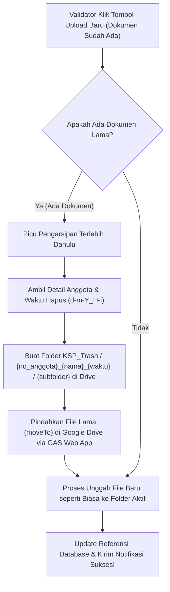

# Bagian 1

## Rencana Implementasi: Perubahan Fitur Edit Dokumen & Sistem Pengarsipan Otomatis (KSP_Trash)

Tentu saja sangat bisa! Ini adalah peningkatan yang sangat luar biasa untuk kenyamanan kerja Validator/Admin serta keamanan dokumen anggota (kepatuhan audit data).

Dengan sistem baru ini:

1. **Input Unggah Selalu Terlihat**: Tombol upload langsung tidak akan hilang/tersembunyi lagi ketika dokumen sudah ada. Validator bisa mengunggah berkas baru langsung di sebelah tombol **Buka** & **Hapus** untuk menimpa dokumen yang lama.
2. **Sistem Pengarsipan KSP_Trash**: Dokumen lama yang dihapus atau ditimpa **tidak akan dibuang secara permanen** ke sampah umum Google Drive. Sistem akan secara otomatis memindahkannya ke dalam struktur direktori dinamis di dalam folder khusus **`KSP_Trash`** di Google Drive Anda.

---

## 🛠️ Persiapan Mandiri (Apa yang Harus Anda Lakukan?)

Untuk membantu saya mewujudkan fitur ini, Anda hanya perlu melakukan **satu persiapan kecil** di editor **Google Apps Script** Anda. Karena kode JavaScript berjalan langsung di server Google atas nama akun Gmail Anda (`koperasiharapanmulyaunp@gmail.com`), Anda perlu memperbarui kode di sana agar mengenali aksi baru `archiveFile`.

### Langkah-langkah Pembaruan Google Apps Script:

1. Masuk ke **[script.google.com](https://script.google.com/)** menggunakan akun **`koperasiharapanmulyaunp@gmail.com`**.
2. Buka proyek **`Jembatan Google Drive KSP`** Anda.
3. Ganti kode `doPost(e)` lama Anda dengan kode lengkap terbaru di bawah ini (yang sudah ditambahkan logika **Aksi D: Pengarsipan Berkas KSP_Trash**):

```javascript
// Token Pengaman - Wajib sama dengan yang ada di google-apps-script-config.json
var API_KEY = "ksp_harapan_mulya_secure_token";

function doPost(e) {
  var result = {};
  try {
    // 1. Validasi Keamanan Token
    var clientKey = e.parameter.key;
    if (clientKey !== API_KEY) {
      throw new Error("Akses Ditolak: Token Pengaman Tidak Valid.");
    }

    var action = e.parameter.action;
  
    // AKSI A: Pengecekan atau Pembuatan Folder Berjenjang
    if (action === 'getOrCreateFolder') {
      var folderName = e.parameter.folderName;
      var parentFolderId = e.parameter.parentFolderId;
  
      var parentFolder;
      if (parentFolderId) {
        parentFolder = DriveApp.getFolderById(parentFolderId);
      } else {
        parentFolder = DriveApp.getRootFolder();
      }
  
      var folders = parentFolder.getFoldersByName(folderName);
      if (folders.hasNext()) {
        result.id = folders.next().getId();
      } else {
        var folder = parentFolder.createFolder(folderName);
        result.id = folder.getId();
      }
      result.success = true;
  
    // AKSI B: Unggah file PDF dari String Base64
    } else if (action === 'uploadFile') {
      var fileName = e.parameter.fileName;
      var parentFolderId = e.parameter.parentFolderId;
      var mimeType = e.parameter.mimeType || 'application/pdf';
      var base64Data = e.parameter.data;
  
      var decoded = Utilities.base64Decode(base64Data);
      var blob = Utilities.newBlob(decoded, mimeType, fileName);
  
      var parentFolder = DriveApp.getFolderById(parentFolderId);
      var file = parentFolder.createFile(blob);
  
      // Mencegah Error 403 Forbidden Download akibat bug Multi-Account Google
      file.setSharing(DriveApp.Access.ANYONE_WITH_LINK, DriveApp.Permission.VIEW);
  
      result.id = file.getId();
      result.success = true;
  
    // AKSI C: Hapus File Permanen (Opsional - Jika masih dibutuhkan)
    } else if (action === 'deleteFile') {
      var driveFileId = e.parameter.driveFileId;
      var file = DriveApp.getFileById(driveFileId);
      file.setTrashed(true);
      result.success = true;
  
    // AKSI D: Pindahkan File ke Folder Arsip KSP_Trash (Fitur Baru!)
    } else if (action === 'archiveFile') {
      var driveFileId = e.parameter.driveFileId;
      var archiveFolderName = e.parameter.archiveFolderName; // Format: {no_anggota}_{nama_anggota}
      var subFolder = e.parameter.subFolder; // Format: 'profil' atau 'pinjaman'
 
      // 1. Dapatkan atau buat folder root 'KSP_Trash'
      var rootFolder = DriveApp.getRootFolder();
      var kspTrashFolder;
      var trashFolders = rootFolder.getFoldersByName('KSP_Trash');
      if (trashFolders.hasNext()) {
        kspTrashFolder = trashFolders.next();
      } else {
        kspTrashFolder = rootFolder.createFolder('KSP_Trash');
      }
 
      // 2. Dapatkan atau buat folder arsip spesifik di bawah KSP_Trash
      var archiveFolder;
      var archiveFolders = kspTrashFolder.getFoldersByName(archiveFolderName);
      if (archiveFolders.hasNext()) {
        archiveFolder = archiveFolders.next();
      } else {
        archiveFolder = kspTrashFolder.createFolder(archiveFolderName);
      }
 
      // 3. Dapatkan atau buat subfolder ('profil' atau 'pinjaman') di bawah folder arsip tersebut
      var targetSubFolder;
      var subFolders = archiveFolder.getFoldersByName(subFolder);
      if (subFolders.hasNext()) {
        targetSubFolder = subFolders.next();
      } else {
        targetSubFolder = archiveFolder.createFolder(subFolder);
      }
 
      // 4. Dapatkan file, beri nama baru dengan timestamp, lalu pindahkan
      var file = DriveApp.getFileById(driveFileId);
      var timestamp = Utilities.formatDate(new Date(), Session.getScriptTimeZone(), "dd-MM-yyyy_HH-mm");
      var originalName = file.getName();
      var dotIndex = originalName.lastIndexOf(".");
      var newName;
      if (dotIndex !== -1) {
        newName = originalName.substring(0, dotIndex) + "_" + timestamp + originalName.substring(dotIndex);
      } else {
        newName = originalName + "_" + timestamp;
      }
      file.setName(newName);
      file.moveTo(targetSubFolder);
   
      result.success = true;
  
    } else {
      throw new Error('Aksi tidak dikenal: ' + action);
    }
  
  } catch (err) {
    result.success = false;
    result.error = err.toString();
  }
  
  return ContentService.createTextOutput(JSON.stringify(result))
    .setMimeType(ContentService.MimeType.JSON);
}
```

4. **Wajib Deploy Ulang Ke Versi Baru**:
   - Setelah menempelkan kode di atas, simpan proyek (`Ctrl + S`).
   - Klik tombol **Deploy** di kanan atas -> pilih **Manage deployments**.
   - Klik ikon **Pensil (Edit)** di kanan atas dialog.
   - Pada pilihan dropdown *Version*, pilih **New version** (Versi Baru).
   - Klik tombol **Deploy** dan tunggu hingga selesai. (Anda tidak perlu menyalin URL-nya lagi jika tidak ada perubahan, karena URL deployment biasanya tetap sama jika di-update menggunakan "New version").

Setelah langkah persiapan di atas selesai Anda lakukan, silakan beri tahu saya agar saya dapat langsung memproses kode PHP di aplikasi Laragon Anda!

---

## 📐 Penjelasan Rencana & Pendekatan Teknis (PHP Backend & UI)

Saya akan mengurus modifikasi penuh pada kode aplikasi di Laragon Anda. Berikut adalah detail perubahan yang akan saya lakukan setelah Anda menyetujui rencana ini:



### 1. Integrasi Driver Cloud (`GoogleDriveService.php`)

Menambahkan metode baru `archiveFile($driveFileId, $archiveFolderName, $subFolder)` di kelas `GoogleDriveService`. Metode ini akan memicu cURL ke Web App Google Apps Script Anda dengan aksi `archiveFile`.

### 2. Refaktorisasi Logika Controller (`AnggotaController.php`)

- **`deleteDokumen($id)`**: Diubah agar tidak menghapus permanen. Sistem akan membuat timestamp hapus `$waktuHapus = date('d-m-Y_H-i')` dan folder arsip `{$noAnggota}_{$nama}_{$waktuHapus}`. Kemudian memindahkan file ke `KSP_Trash/{archiveFolder}/{subfolder}`.
- **`uploadDokumen($id)`**: Ditambahkan pengecekan *overwrite*. Jika dokumen sejenis sudah ada untuk anggota tersebut, sistem akan memicu proses pengarsipan ke `KSP_Trash` terlebih dahulu untuk dokumen lama sebelum dokumen baru diunggah dan disimpan ke database.
- **Dukungan Offline Local Fallback**: Jika sistem terpaksa menggunakan mode lokal (offline), proses pengarsipan juga akan diduplikasi secara lokal ke direktori `public/uploads/KSP_Trash/{archiveFolder}/{subfolder}/` menggunakan fungsi pemindahan file PHP agar performa tetap prima dan data selalu terjaga!

### 3. Pembaruan Antarmuka Pengguna / UI (`views/anggota/edit.php`)

Kami merancang ulang tata letak panel **Dokumen Kelengkapan** agar sangat elegan, modern, dan selalu ramah pengguna:

- **Tampilan Bersih**: Jika dokumen sudah ada, akan tampil indikator *"Terunggah"* berwarna hijau zamrud dengan teks tipis yang rapi.
- **Tombol Aksi Kompak**: Tombol **Buka** (biru muda) dan **Hapus** (merah crimson) diletakkan berdampingan dengan cantik.
- **Form Unggah Terbuka (Selalu Terlihat)**: Input file dan tombol upload bermotif modern diletakkan tepat di bawah status dokumen saat ini dengan teks instruksi tipis *"Unggah file baru untuk menimpa dokumen lama"*, sehingga meminimalkan jumlah klik pengguna.

---

## 🗂️ Berkas yang Akan Diubah (Proposed Changes)

### [Component: Google Drive Integration & Backend Service]

#### [MODIFY] [GoogleDriveService.php](file:///c:/laragon/www/Ksp_Koperasinat/app/services/GoogleDriveService.php)

Menambahkan fungsi `archiveFile()` untuk memanggil API pengarsipan di Google Apps Script.

#### [MODIFY] [AnggotaController.php](file:///c:/laragon/www/Ksp_Koperasinat/app/controllers/AnggotaController.php)

Merefaktor fungsi `uploadDokumen()` dan `deleteDokumen()` untuk mengintegrasikan alur pemindahan berkas ke `KSP_Trash` (cloud dan lokal).

---

### [Component: User Interface & Presentation Layer]

#### [MODIFY] [edit.php](file:///c:/laragon/www/Ksp_Koperasinat/views/anggota/edit.php)

Mendesain ulang kolom daftar dokumen kelengkapan agar input upload dan tombol aksi (Buka & Hapus) dapat tampil harmonis secara bersamaan demi efisiensi kerja.

---

## 🧪 Rencana Verifikasi (Verification Plan)

### Verifikasi Manual:

1. **Uji Pengarsipan Hapus**:
   - Klik tombol **Hapus** pada salah satu dokumen anggota (misal: KTP).
   - Pastikan notifikasi sukses dari SweetAlert2 muncul.
   - Periksa database: record untuk KTP anggota tersebut harus terhapus.
   - Periksa Google Drive: dokumen KTP tersebut harus pindah ke `KSP_Trash / {no_anggota}_{nama}_{waktu} / profil / {nama_file}.pdf`.
2. **Uji Pengarsipan Overwrite**:
   - Pilih dokumen KTP yang sudah ada, lalu pilih file PDF baru di input unggah yang selalu terlihat.
   - Klik tombol **Simpan / Upload**.
   - Pastikan SweetAlert2 sukses tampil.
   - Periksa Google Drive: file KTP lama harus pindah ke folder `KSP_Trash` dengan nama folder yang memuat timestamp saat penimpahan terjadi. File baru harus terisi di folder aktif (`KSP / {no_anggota}_{nama} / profil / {nama_file}.pdf`).
3. **Uji Robust Offline Local Fallback**:
   - Simulasikan Google Drive offline (misal dengan mengubah token keamanan di config secara sengaja).
   - Coba lakukan penghapusan atau penimpahan file.
   - Verifikasi berkas terarsip dengan aman di folder lokal `public/uploads/KSP_Trash/...` dan sistem koperasi tetap bekerja mulus!

# Bagian 2
